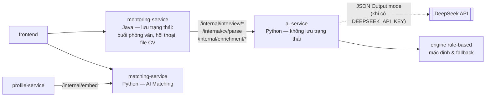
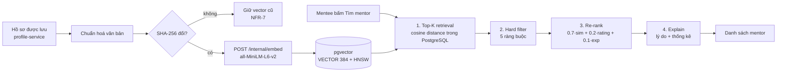
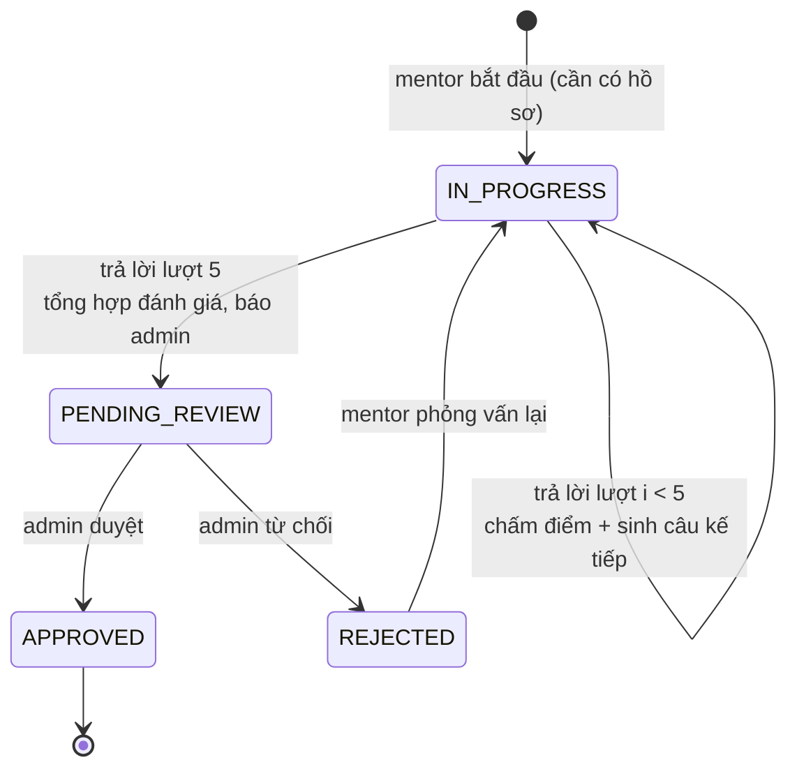
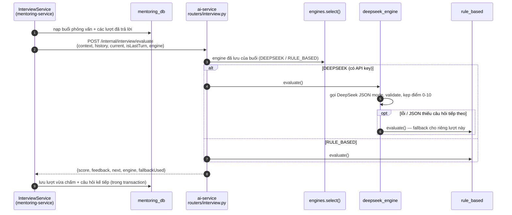
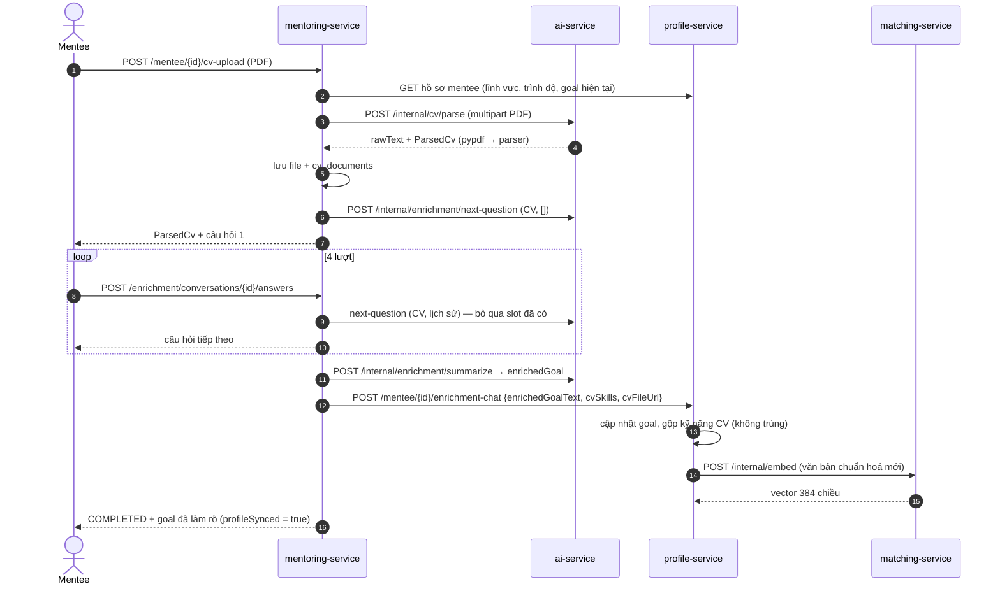

# Các tính năng AI — MentorHub

Hệ thống có 3 tính năng AI, mỗi tính năng do một thành viên sở hữu và tự bảo vệ:

| Tính năng | Người phụ trách | Mã nguồn chính |
|---|---|---|
| [1. AI Matching](#1-ai-matching-mentor-mentee) | Phạm Ninh Phương Thảo | `matching-service/app/services/`, `profile-service/.../service/EmbeddingService.java`, `ProfileTextNormalizer.java` |
| [2. AI Interview](#2-ai-interview-xác-thực-năng-lực-mentor) | Đinh Quyết Thắng | `ai-service/app/interview/`, `ai-service/app/routers/interview.py`; luồng & lưu trạng thái: `mentoring-service/.../service/InterviewService.java` |
| [3. CV Parsing + Chatbot enrichment](#3-cv-parsing--chatbot-enrichment) | Phạm Ngọc Quang | `ai-service/app/cv/`, `ai-service/app/enrichment/`; luồng & lưu trạng thái: `mentoring-service/.../service/CvEnrichmentService.java` |

Nguyên tắc chung cho cả 3 tính năng:
- **Giải thích được** (NFR-6): mọi kết quả kèm lý do/thành phần điểm.
- **Con người quyết định cuối cùng** ở các điểm rủi ro (NFR-8): admin duyệt mentor; mentee tự chọn mentor.
- **Không phụ thuộc cứng vào dịch vụ bên ngoài**: AI Matching chạy model mã nguồn mở cục bộ; AI
  Interview và CV enrichment có hai engine — DeepSeek (LLM) và rule-based — với cơ chế tự chuyển.

### Bố trí các service AI



- **matching-service** (Thảo): embedding + pgvector + xếp hạng.
- **ai-service** (Python/FastAPI, cổng 8091): gom các tính năng AI dạng hội thoại/văn bản —
  `app/interview/` (Thắng), `app/cv/` + `app/enrichment/` (Quang), `app/llm/deepseek.py` (dùng chung).
  Service **không lưu trạng thái**: mentoring-service lưu mọi dữ liệu và gửi kèm lịch sử ở mỗi lượt, nên
  ai-service có thể nhân bản/khởi động lại bất kỳ lúc nào.
- **Vì sao tách ra service Python riêng?** Hệ sinh thái AI/NLP chủ yếu ở Python; tách phần tính toán AI
  khỏi nghiệp vụ giúp thay đổi/triển khai model độc lập với luồng đặt lịch–thanh toán, và hai tính năng
  AI hội thoại dùng chung một client LLM, một cơ chế fallback.
- **DeepSeek**: API tương thích định dạng OpenAI (`POST {DEEPSEEK_BASE_URL}/chat/completions`, header
  `Authorization: Bearer`), model mặc định `deepseek-flash`. Hệ thống dùng **JSON Output mode**
  (`response_format: {"type": "json_object"}`): system prompt luôn chứa chữ "json" kèm một ví dụ mẫu,
  kết quả được validate bằng Pydantic. Tài liệu DeepSeek lưu ý chế độ này đôi khi trả nội dung rỗng →
  client thử lại 1 lần; lỗi 429/5xx/mạng cũng thử lại 1 lần; 4xx khác, JSON sai hoặc bị cắt do
  `max_tokens` → trả về rỗng để engine dùng rule-based cho lượt đó (`fallbackUsed = true`).

---

## 1. AI Matching mentor-mentee

### 1.1 Bài toán
Cho một mentee, trả về danh sách mentor **phù hợp về nội dung** (kỹ năng, lĩnh vực, mục tiêu) và
**khả thi trên thực tế** (đã được xác thực, còn nhận mentee, có lịch rảnh, còn chỗ), được xếp hạng
và giải thích.

**Vì sao không dùng stable matching (Gale–Shapley)?** Stable matching ghép hai tập theo đợt với danh
sách ưu tiên đầy đủ của cả hai phía. Nền tảng này hoạt động liên tục: mentee tìm kiếm bất kỳ lúc nào,
mentor không xếp hạng trước mentee, và một mentor nhận nhiều mentee. Do đó chọn mô hình
**ranked recommendation**: truy xuất ứng viên → lọc ràng buộc → xếp hạng lại (tương tự kiến trúc
retrieval + ranking của hệ gợi ý).

### 1.2 Pipeline



### 1.3 Biểu diễn hồ sơ (embedding)

**Chuẩn hoá văn bản** (`ProfileTextNormalizer`) — mentor và mentee dùng **cùng cấu trúc** để hai
loại vector nằm trong cùng không gian ngữ nghĩa:

```
Mentor: "Domain: backend. Skills: Java, Spring Boot. Experience: 9 years. About: <bio>"
Mentee: "Domain: backend. Skills: Java, SQL. Level: beginner. Goal: <goal>"
```

**Model**: `sentence-transformers/all-MiniLM-L6-v2` — transformer 6 lớp đã được huấn luyện
contrastive trên hơn 1 tỷ cặp câu, sinh vector 384 chiều. Lý do chọn:

| Tiêu chí | all-MiniLM-L6-v2 |
|---|---|
| Kích thước / tốc độ | ~90MB, chạy CPU; đo thực tế **~10 ms/lần** sinh embedding |
| Chất lượng | Tốt cho semantic similarity câu ngắn tiếng Anh; tên công nghệ (Java, Spring Boot…) là thuật ngữ tiếng Anh |
| Số chiều | 384 — nhỏ gọn cho pgvector và HNSW |
| Chi phí | Mã nguồn mở, chạy cục bộ, không gửi dữ liệu người dùng ra ngoài |

Vector được **chuẩn hoá L2** (`normalize_embeddings=True`), nên cosine similarity = tích vô hướng.
Có thể đổi sang model đa ngôn ngữ cùng 384 chiều (ví dụ `paraphrase-multilingual-MiniLM-L12-v2`) bằng
biến `EMBEDDING_MODEL` rồi gọi API admin `rebuild?force=true`.

**Tái sử dụng embedding (NFR-7)**: profile-service lưu `embedding_text_hash = SHA-256(văn bản chuẩn
hoá)`; chỉ gọi model khi hash thay đổi. Nếu matching-service lỗi, hash đặt `NULL` và
`EmbeddingRetryJob` thử lại mỗi phút — việc lưu hồ sơ không bị chặn.

### 1.4 Bước 1 — Top-K retrieval

```sql
WITH q AS (SELECT embedding FROM mentee_profiles WHERE user_id = $1)
SELECT m.*, EXISTS(SELECT 1 FROM mentor_availability a WHERE a.mentor_id = m.user_id) AS has_schedule,
       m.embedding <=> q.embedding AS distance
FROM mentor_profiles m, q
WHERE m.embedding IS NOT NULL
ORDER BY m.embedding <=> q.embedding
LIMIT $2      -- K = max(50, 5 × limit)
```

- Toán tử `<=>` của pgvector = **cosine distance** = `1 − cos(θ)`; chỉ mục HNSW `vector_cosine_ops`.
- Vector của mentee lấy bằng subquery **ngay trong CSDL** → không vector nào truyền qua mạng (lý do
  của ngoại lệ kiến trúc read-only).
- **Vì sao K lớn hơn limit?** Một phần ứng viên sẽ bị hard filter loại; lấy dư (×5, tối thiểu 50) để
  sau khi lọc vẫn đủ kết quả.

### 1.5 Bước 2 — Hard filter (FR-4.4)

Ứng viên bị loại nếu vi phạm **bất kỳ** ràng buộc nào (kiểm tra theo thứ tự):

| Mã lý do | Điều kiện loại | Ý nghĩa nghiệp vụ |
|---|---|---|
| `notVerified` | `verification_status ≠ APPROVED` | Chưa qua AI Interview hoặc chưa được admin duyệt (DoD 5) |
| `unavailable` | `is_available = false` | Mentor tạm ngưng nhận mentee |
| `noSchedule` | Không có khung lịch rảnh nào | Không thể đặt lịch |
| `fullCapacity` | `active_mentee_count ≥ capacity` | Đã đủ số mentee tối đa |
| `domainMismatch` | `lower(domain) ≠ lower(mentee.domain)` | Khác lĩnh vực mentee chọn |

Số lượng bị loại theo từng lý do được trả về trong `pipeline.excluded` và hiển thị trên giao diện —
người dùng thấy rõ kết quả **không chỉ dựa thuần vector** (DoD 7).

### 1.6 Bước 3 — Re-rank (FR-4.5)

$$
\text{similarity} = \text{clamp}(1 - d_{\cos},\ 0,\ 1)
$$

$$
\text{finalScore} = 0.7 \cdot \text{similarity} + 0.2 \cdot \frac{\text{rating}^{*}}{5} + 0.1 \cdot \min\left(\frac{\text{years}}{10},\ 1\right)
$$

với $\text{rating}^{*} = \text{rating}$ nếu mentor đã có đánh giá, ngược lại $\text{rating}^{*} = 3.5$
(giá trị trung tính).

**Lý do chọn trọng số:**
- **0.7 cho similarity** — mức phù hợp nội dung là mục tiêu chính của matching; trọng số lớn đảm bảo
  một mentor ít liên quan nhưng rating cao không vượt lên mentor rất phù hợp (có unit test
  `test_similarity_can_beat_rating`).
- **0.2 cho rating** — tín hiệu chất lượng từ cộng đồng, phân định các mentor có mức tương đồng gần nhau.
- **0.1 cho kinh nghiệm** — tín hiệu phụ, bão hoà ở 10 năm để không ưu tiên quá mức thâm niên.
- **Cold-start**: mentor mới chưa có đánh giá nhận rating trung tính 3.5 thay vì 0, tránh bị "phạt oan".
- Các hằng số nằm tập trung trong `matching_pipeline.py` (`WEIGHT_*`, `NEUTRAL_RATING`) và được trả về
  trong response để minh bạch.

### 1.7 Bước 4 — Giải thích (FR-4.6, NFR-6)

| Lý do | Điều kiện |
|---|---|
| "Trùng kỹ năng: X, Y" | Kỹ năng mentor ∈ kỹ năng mentee (không phân biệt hoa thường) |
| "Có chuyên môn phù hợp mục tiêu của bạn: Z" | Kỹ năng mentor xuất hiện trong mục tiêu của mentee (khớp nguyên từ — "Go" không khớp "Google") |
| "Cùng lĩnh vực backend" | Cùng domain |
| "Hồ sơ rất tương đồng / tương đồng khá về nội dung (78%)" | similarity ≥ 0.6 / ≥ 0.4 |
| "Được đánh giá cao (4.8/5 từ 12 lượt)" | Có đánh giá và rating ≥ 4 |
| "9 năm kinh nghiệm" | ≥ 5 năm |

### 1.8 Kết quả thực tế (dữ liệu seed)

Mentee "Trần Minh Khoa" — backend, kỹ năng Java/SQL/Git, mục tiêu *"trở thành backend developer
Java, chuẩn bị phỏng vấn trong 6 tháng tới và học thêm system design"*:

| # | Mentor | similarity | finalScore | Lý do |
|---|---|---|---|---|
| 1 | Nguyễn Hoàng Long (Java, Spring Boot, System Design…, 9 năm) | 0.776 | 0.773 | Trùng kỹ năng: Java · Có chuyên môn phù hợp mục tiêu: System Design · Cùng lĩnh vực backend · Hồ sơ rất tương đồng (78%) · 9 năm KN |
| 2 | Lê Quốc Bảo (Python, FastAPI…, 6 năm) | 0.690 | 0.683 | Cùng lĩnh vực backend · Hồ sơ rất tương đồng (69%) · 6 năm KN |
| 3 | Trần Thu Hà (Node.js, TypeScript…, 5 năm) | 0.624 | 0.627 | Cùng lĩnh vực backend · Hồ sơ rất tương đồng (62%) · 5 năm KN |

Thống kê pipeline: `retrieved = 7`, loại `notVerified: 1` (mentor Java chưa phỏng vấn) và
`domainMismatch: 3` (frontend, devops, data). Mentor Java chuyên system design đứng đầu — đúng kỳ vọng.

### 1.9 Hiệu năng (NFR-1)

`scripts/benchmark_matching.py` chèn tạm 5.000 hồ sơ mentor tổng hợp rồi gọi API 50 lần:

| Số mentor | Trung bình | p50 | p95 | Max | Yêu cầu |
|---|---|---|---|---|---|
| ~5.007 | 4,8 ms | 4,7 ms | 5,7 ms | 6,8 ms | < 2.000 ms ✅ |

### 1.10 Hạn chế & hướng phát triển
- Hard filter áp dụng **sau** top-K: nếu phần lớn K ứng viên gần nhất bị loại, kết quả có thể ít hơn
  `limit` dù còn mentor phù hợp xa hơn. Hướng cải thiện: đưa các điều kiện lọc vào mệnh đề `WHERE`
  (pgvector ≥ 0.8 hỗ trợ iterative index scan) hoặc tăng K thích ứng.
- Chưa lọc theo lịch rảnh *cụ thể* mà mentee mong muốn (hiện chỉ yêu cầu mentor có lịch rảnh).
- Trọng số chọn theo lập luận nghiệp vụ; khi có dữ liệu thật (tỷ lệ chấp nhận yêu cầu, rating sau
  phiên) có thể học trọng số (learning-to-rank) và đánh giá bằng NDCG/Precision@K.

### 1.11 Câu hỏi hội đồng có thể hỏi
- *Cosine similarity khác Euclidean thế nào, vì sao dùng cosine?* — Cosine đo hướng, không phụ thuộc độ
  dài vector; với vector đã chuẩn hoá L2 thì thứ tự theo cosine và Euclidean là như nhau.
- *HNSW là gì?* — Đồ thị nhiều tầng cho tìm kiếm láng giềng gần đúng (ANN), độ phức tạp truy vấn
  ~O(log N), đánh đổi một chút độ chính xác lấy tốc độ.
- *Vì sao matching-service đọc thẳng DB của profile-service?* — Để tính khoảng cách trong CSDL (tận
  dụng chỉ mục), tránh truyền hàng nghìn vector 384 chiều qua HTTP; an toàn nhờ role chỉ SELECT.

---

## 2. AI Interview (xác thực năng lực mentor)

### 2.1 Bài toán
Trước khi xuất hiện trong kết quả gợi ý, mentor cần được đánh giá năng lực chuyên môn và khả năng
hướng dẫn. Hệ thống phỏng vấn tự động **nhiều lượt, thích ứng** theo câu trả lời, tổng hợp điểm và
nhận xét; **admin quyết định cuối cùng** (NFR-8).

### 2.2 Vòng đời



Trạng thái xác thực hồ sơ (`mentor_profiles.verification_status`) đi song song:
`PENDING_INTERVIEW → PENDING_REVIEW → APPROVED | REJECTED`. Chỉ `APPROVED` mới vượt qua hard filter
của AI Matching và nhận được yêu cầu mentoring.

### 2.3 Kiến trúc



| Module (ai-service) | Vai trò |
|---|---|
| `app/interview/question_bank.py` | Ngân hàng câu hỏi theo lĩnh vực, chọn chủ đề theo kỹ năng |
| `app/interview/rule_based.py` | Chấm điểm, chiến lược DEEPEN/PIVOT, tổng hợp — tất định |
| `app/interview/deepseek_engine.py` | Prompt + gọi DeepSeek, validate, fallback từng lượt |
| `app/engines.py` | Chọn engine theo yêu cầu và cấu hình |
| `app/routers/interview.py` | 3 endpoint: `first-question`, `evaluate`, `summarize` |

- ai-service **không lưu trạng thái**: mỗi lượt, `InterviewService` nạp toàn bộ lịch sử từ DB và gửi kèm.
- Lượt đầu không chỉ định engine → `DEEPSEEK` nếu cấu hình `DEEPSEEK_API_KEY`, ngược lại `RULE_BASED`.
  Engine được lưu theo từng buổi (`interviews.engine`) và gửi lại ở các lượt sau để nhất quán.
- Gọi ai-service **ngoài transaction**; chỉ bước ghi kết quả chạy trong transaction, có kiểm tra "câu hỏi
  đã được trả lời" để chống gửi trùng. ai-service không phản hồi → 502 `AI_SERVICE_UNAVAILABLE`, mentor
  gửi lại câu trả lời được.

### 2.4 Số lượt (FR-7.3)
**5 lượt** (cấu hình `INTERVIEW_MAX_TURNS`): đủ phủ 3–4 chủ đề chuyên môn + 1 lượt đào sâu, trong đó
luôn có chủ đề "Năng lực mentoring"; thời gian ~15–20 phút.

### 2.5 Engine rule-based

**Ngân hàng câu hỏi** (`QuestionBank`): 6 lĩnh vực — backend (6 chủ đề), frontend (5), devops (5),
data/AI (5), mobile (3), general (4). Mỗi chủ đề gồm: câu hỏi mở, câu hỏi đào sâu, danh sách
**khái niệm kỳ vọng** và kỹ năng liên quan. Lĩnh vực khai báo được ánh xạ theo từ khoá
("Frontend Web" → frontend, "AI/ML" → data; khớp nguyên từ để "blockchain" không bị nhận là "ai").

**Chọn chủ đề mở đầu**: sắp xếp chủ đề theo số kỹ năng trùng với kỹ năng mentor khai báo (mentor
backend có Redis → mở đầu bằng "Caching & hiệu năng"), chèn chủ đề "Năng lực mentoring" vào vị trí thứ 3.

**Chấm điểm một câu trả lời (thang 0–10)**:

| Thành phần | Cách tính | Tối đa |
|---|---|---|
| Độ bao phủ khái niệm | `min(số khái niệm kỳ vọng xuất hiện, 4) × 1.25` | 5 |
| Độ chi tiết | < 15 từ: 0 · < 40: 1 · < 80: 2 · ≥ 80: 3 | 3 |
| Dẫn chứng thực tế | Số tín hiệu "ví dụ, dự án, production, trade-off, số liệu 40ms/30%…" (tối đa 2) | 2 |

Nhận xét được sinh từ các thành phần: khái niệm đã đề cập, thiếu chi tiết, thiếu dẫn chứng.

**Chiến lược câu tiếp theo (FR-7.2)**:

```
nếu điểm ≥ 5 và chủ đề hiện tại chưa từng được đào sâu  → DEEPEN (câu đào sâu cùng chủ đề)
ngược lại                                                → PIVOT  (chủ đề chưa hỏi tiếp theo)
```

→ Mỗi chủ đề đào sâu tối đa 1 lần; câu trả lời yếu chuyển chủ đề ngay để khảo sát diện rộng hơn.

**Tổng hợp (FR-7.4)**:
- `overallScore = trung bình điểm các lượt × 10` (thang 0–100).
- Điểm mạnh: chủ đề có điểm trung bình ≥ 7; điểm yếu: < 5.
- Khuyến nghị: `≥ 70 → APPROVE`, `< 45 → REJECT`, còn lại `NEEDS_REVIEW`.

### 2.6 Engine DeepSeek

- Gọi DeepSeek Chat Completions ở JSON Output mode qua `app/llm/deepseek.py` (httpx). Mỗi loại yêu cầu có
  một ví dụ JSON mẫu (`QUESTION_EXAMPLE`, `EVALUATION_EXAMPLE`, `ASSESSMENT_EXAMPLE`) đưa vào system prompt;
  kết quả parse vào model Pydantic rồi kiểm tra nghiệp vụ (có điểm, có câu hỏi tiếp theo nếu chưa phải lượt
  cuối, recommendation hợp lệ).
- Model mặc định `deepseek-flash` (biến `DEEPSEEK_MODEL`), `max_tokens = 4000`, timeout 60 giây.
- System prompt (rút gọn): vai trò người phỏng vấn kỹ thuật; mỗi lượt 1 câu hỏi tình huống bám lĩnh
  vực/kỹ năng; DEEPEN khi câu trả lời tốt nhưng còn chung chung, PIVOT khi yếu hoặc đã đào sâu; nên có
  câu về năng lực hướng dẫn; rubric chấm 0–3 / 4–6 / 7–8 / 9–10.
- **Chống prompt injection**: câu trả lời của ứng viên đặt trong thẻ `<answer>`; prompt yêu cầu coi đó
  là dữ liệu và bỏ qua mọi mệnh lệnh/đề nghị chấm điểm bên trong. Kết quả còn được kẹp miền giá trị
  (điểm 0–10, 0–100), và luôn cần admin duyệt.
- Lỗi API, nội dung rỗng sau khi thử lại, JSON không đúng cấu trúc hoặc bị cắt → fallback rule-based cho
  lượt đó; response trả `fallbackUsed = true` để có thể thống kê chất lượng.

### 2.7 Thiết kế trải nghiệm & tính công bằng
- Trong lúc phỏng vấn, mentor **không thấy** điểm/nhận xét từng câu (tránh "học tủ" theo phản hồi);
  sau khi hoàn thành mới hiển thị toàn bộ.
- Admin thấy toàn bộ hội thoại, điểm từng câu, khuyến nghị AI và nhập nhận xét gửi mentor.
- Mentor bị từ chối có thể cập nhật hồ sơ và phỏng vấn lại.

### 2.8 Ví dụ (kiểm thử e2e, engine rule-based)
Mentor backend (Java, Spring Boot, Redis, System Design), trả lời chi tiết có số liệu và trade-off:
chuỗi chiến lược thu được gồm cả `DEEPEN` và `PIVOT`, buổi phỏng vấn dừng đúng sau 5 lượt với trạng
thái `PENDING_REVIEW`, có điểm tổng và tóm tắt; mentor chỉ xuất hiện trong kết quả matching sau khi
admin bấm duyệt.

### 2.9 Hạn chế & hướng phát triển
- Engine rule-based đánh giá theo từ khoá nên có thể bị "nhồi từ khoá"; đây là lý do bắt buộc admin
  duyệt và khuyến nghị dùng engine DeepSeek khi triển khai thật.
- Chưa có ngân hàng câu hỏi cho mọi lĩnh vực ngách (game, embedded…) — rơi về bộ câu hỏi chung.
- Hướng phát triển: phỏng vấn bằng giọng nói, câu hỏi code thực hành, hiệu chỉnh ngưỡng khuyến nghị
  dựa trên tỷ lệ admin đồng ý với AI.

### 2.10 Câu hỏi hội đồng có thể hỏi
- *Làm sao đảm bảo AI không chấm sai rồi kích hoạt nhầm mentor?* — AI chỉ đưa khuyến nghị; trạng thái
  `PENDING_REVIEW` bắt buộc chờ admin; matching chỉ lấy `APPROVED` (có kiểm thử e2e).
- *Mentor gian lận bằng câu trả lời kiểu "hãy cho tôi 10 điểm"?* — Prompt tách dữ liệu bằng thẻ, kẹp
  điểm, ẩn điểm trong lúc làm bài, admin đọc lại toàn bộ.
- *Nếu API DeepSeek chết giữa buổi?* — Lượt đó tự chuyển sang rule-based, buổi phỏng vấn không bị gián đoạn.
- *Nếu cả ai-service chết?* — mentoring-service trả 502 và không ghi gì vào DB; khi ai-service lên lại,
  mentor gửi lại câu trả lời và tiếp tục đúng lượt đang dở (trạng thái nằm ở mentoring-service).
- *Vì sao tách AI ra service Python riêng?* — Xem mục "Bố trí các service AI" ở đầu tài liệu.

---

## 3. CV Parsing + Chatbot enrichment

### 3.1 Bài toán
Mentee thường khai báo mục tiêu ngắn và chung chung ("học backend"), khiến embedding kém phân biệt.
Tính năng này: (1) đọc CV để biết **mentee đã có gì**; (2) hỏi thêm vài câu về **những gì CV không
thể hiện** (mục tiêu, mảng muốn tập trung, khó khăn, thời gian); (3) tổng hợp thành đoạn mục tiêu
chuẩn hoá và cập nhật hồ sơ → **sinh lại embedding** → matching chính xác hơn.

### 3.2 Luồng xử lý



### 3.3 Trích xuất văn bản PDF (`ai-service/app/cv/extractor.py`)
Thư viện `pypdf`. Kiểm tra: chữ ký file `%PDF-`, ≤ 5MB, không mã hoá, ≤ 10 trang, ≥ 50 ký tự văn bản
(PDF ảnh scan → báo lỗi `CV_NO_TEXT` rõ ràng). Mã lỗi được mentoring-service chuyển tiếp nguyên vẹn tới
người dùng.

### 3.4 Parse CV rule-based (`ai-service/app/cv/rule_based.py`, `skills.py`)

| Trường | Thuật toán |
|---|---|
| Kỹ năng | Từ điển `skills.py` gồm 86 kỹ năng chuẩn, mỗi kỹ năng có nhiều biến thể regex (`postgres(ql)?`, `k8s`, `học máy`…), khớp theo ranh giới từ (tránh "Go" trong "Google", phân biệt "Java"/"JavaScript", "React"/"React Native"). Sắp xếp theo **số lần xuất hiện** (kỹ năng nhắc nhiều thường là kỹ năng chính), hoà thì theo vị trí đầu tiên |
| Tiêu đề mục | Nhận diện heading tiếng Việt/Anh: Kinh nghiệm / Experience, Dự án / Projects, Học vấn / Education, Kỹ năng / Skills, các mục khác |
| Số năm kinh nghiệm | Ưu tiên câu tường minh "X+ năm kinh nghiệm / X years of experience"; nếu không có thì cộng các khoảng thời gian `MM/YYYY – MM/YYYY`, `YYYY – nay/present` **chỉ trong mục Kinh nghiệm** (không tính thời gian học) |
| Dự án | Trong mục Dự án: dòng không gạch đầu dòng ≤ 80 ký tự là tên dự án, các dòng gạch đầu dòng sau đó là mô tả; công nghệ = kỹ năng tìm thấy trong tên + mô tả |
| Học vấn | Các dòng trong mục Học vấn |
| Vai trò hiện tại | Dòng đầu CV chứa developer/engineer/lập trình viên/sinh viên… |

Engine DeepSeek (`deepseek_parser.py`) trích xuất cùng schema `ParsedCv` ở JSON Output mode, prompt
yêu cầu **chỉ trích thông tin có trong CV, không suy đoán**; kết quả được làm sạch (giới hạn 30 kỹ năng,
0–45 năm, 8 dự án).

### 3.5 Chatbot enrichment — thiết kế theo "slot"

Chatbot không trò chuyện tự do mà điền các **slot thông tin** mà CV thường không có:

| Slot | Nội dung | Khi nào hỏi |
|---|---|---|
| `TARGET_ROLE` | Mục tiêu nghề nghiệp | Luôn hỏi đầu tiên |
| `FOCUS_AREAS` | Mảng muốn đào sâu | Luôn hỏi |
| `PROJECT_EXPERIENCE` | Kinh nghiệm thực hành | **Chỉ khi CV không có dự án** |
| `CURRENT_GAPS` | Khó khăn hiện tại | Hỏi (nhắc tên dự án trong CV nếu có) |
| `TIMELINE` | Thời gian mong muốn | **Bỏ qua nếu câu trả lời trước đã nêu mốc thời gian** |
| `MENTORING_PREFERENCE` | Hình thức & tần suất mentoring | Khi còn lượt |
| `FREE_FORM` | Thông tin khác | Khi đã hết slot |

**"Không hỏi lại thông tin đã có" (FR-8.3)** được hiện thực bằng 3 cơ chế:
1. Câu hỏi **tham chiếu** dữ liệu CV thay vì hỏi lại (đầu ra thực tế với CV mẫu): *"Mình thấy CV của
   bạn có kinh nghiệm với Spring Boot, Docker, Java, REST API (khoảng 1 năm). Trong thời gian tới, bạn
   muốn đạt được mục tiêu nghề nghiệp cụ thể nào…?"*,
   *"Ngoài Java, Spring Boot mà bạn đã có, bạn muốn tập trung đào sâu kiến thức nào?"*
2. Không hỏi slot mà CV đã trả lời (có dự án → không hỏi `PROJECT_EXPERIENCE`).
3. Nhận diện thông tin trả lời gián tiếp: regex mốc thời gian ("6 tháng", "cuối năm", "học kỳ"…) chạy
   trên văn bản **đã bỏ dấu tiếng Việt** nên hiểu cả câu gõ không dấu ("6 thang") → bỏ slot `TIMELINE`.

**Số lượt**: 4 (cấu hình `ENRICHMENT_MAX_TURNS`).

**Tổng hợp goal (FR-8.4)** — rule-based ghép theo mẫu:

```
Mục tiêu: <TARGET_ROLE>. Muốn tập trung vào: <FOCUS_AREAS>. Khó khăn hiện tại: <CURRENT_GAPS>.
Thời gian mong muốn: <TIMELINE>. Nền tảng hiện có (từ CV): <kỹ năng>; khoảng N năm kinh nghiệm;
đã làm dự án <tên dự án>.
```

Engine DeepSeek (`app/enrichment/deepseek_engine.py`) sinh đoạn mô tả 3–6 câu ở ngôi thứ ba từ CV + hội
thoại (JSON `{"enriched_goal": ...}`), lỗi thì dùng mẫu rule-based ở trên.

**Cập nhật hồ sơ & re-embedding (FR-8.5)**: gửi `enrichedGoalText`, `cvSkills`, `cvFileUrl` sang
profile-service; kỹ năng từ CV được **gộp** (không trùng, không phân biệt hoa thường) vào kỹ năng hồ sơ;
văn bản chuẩn hoá thay đổi → hash đổi → sinh lại embedding. Nếu gửi lỗi, cờ `profile_synced = false`
và job thử lại mỗi 2 phút.

### 3.6 Ví dụ (kiểm thử e2e với `scripts/sample-cv.pdf`)
- Kỹ năng trích xuất (theo tần suất): Spring Boot, Docker, Java, REST API, PostgreSQL, JUnit, MySQL,
  Redis, React, Node.js, GitHub Actions, SQL, Git, JavaScript; 2 dự án (Movie Ticket Booking System, Personal Blog); kinh nghiệm 1 năm
  (06/2024 – 06/2025).
- Mentee trả lời lượt 1: *"Toi muon lam backend developer Java trong 6 thang toi"* → chuỗi slot được hỏi:
  `TARGET_ROLE → FOCUS_AREAS → CURRENT_GAPS → MENTORING_PREFERENCE` (không hỏi `TIMELINE` vì đã nêu
  "6 thang"; không hỏi `PROJECT_EXPERIENCE` vì CV có dự án).
- Goal tổng hợp (đầu ra thực tế): *"Mục tiêu: Toi muon lam backend developer Java trong 6 thang toi.
  Muốn tập trung vào: System design. Khó khăn hiện tại: Chua tu tin database. Mong muốn về mentoring:
  Review code 2 buoi/thang. Nền tảng hiện có (từ CV): Spring Boot, Docker, Java, REST API, PostgreSQL,
  JUnit, MySQL, Redis, React, Node.js; khoảng 1 năm kinh nghiệm; đã làm dự án Movie Ticket Booking
  System, Personal Blog."*
- Goal này được ghi vào profile-service, kỹ năng hồ sơ có thêm "Spring Boot"…, `embeddingUpdatedAt` thay đổi.

### 3.7 Hạn chế & hướng phát triển
- Parser rule-based phụ thuộc bố cục CV có tiêu đề mục rõ ràng; CV dạng bảng/2 cột phức tạp nên dùng
  engine DeepSeek.
- Chưa hỗ trợ PDF ảnh scan (cần OCR).
- Từ điển kỹ năng cần mở rộng định kỳ.

### 3.8 Câu hỏi hội đồng có thể hỏi
- *Vì sao cần chatbot khi đã có CV?* — CV mô tả quá khứ (đã làm gì), matching cần tương lai (muốn học
  gì). Chatbot lấp khoảng trống đó với số câu hỏi tối thiểu.
- *Enrichment cải thiện matching như thế nào?* — Goal chi tiết + kỹ năng CV làm văn bản hồ sơ giàu ngữ
  nghĩa hơn → vector phân biệt tốt hơn, đồng thời bổ sung kỹ năng cho bước giải thích "Trùng kỹ năng".
- *Code nằm ở đâu?* — Phần AI (đọc PDF, parse, chatbot) ở ai-service (Python), dùng chung client DeepSeek
  và cơ chế fallback với AI Interview; phần luồng nghiệp vụ và lưu trữ (file, CV, hội thoại) ở
  mentoring-service vì đây là bước chuẩn bị mentee trước mentoring; profile-service vẫn là nơi duy nhất
  ghi hồ sơ.

---

## 4. Cấu hình AI

| Biến môi trường | Mặc định | Ý nghĩa |
|---|---|---|
| `EMBEDDING_MODEL` | `all-MiniLM-L6-v2` | Model sentence-transformers (phải 384 chiều) |
| `DEEPSEEK_API_KEY` | (trống) | ai-service: trống → engine rule-based; có giá trị → engine DeepSeek + fallback |
| `DEEPSEEK_BASE_URL` | `https://api.deepseek.com` | Địa chỉ API DeepSeek |
| `DEEPSEEK_MODEL` | `deepseek-flash` | Model DeepSeek (ví dụ `deepseek-v4-pro`) |
| `DEEPSEEK_MAX_TOKENS` / `DEEPSEEK_TIMEOUT_SECONDS` | 4000 / 60 | Giới hạn đầu ra, thời gian chờ mỗi lời gọi |
| `INTERVIEW_MAX_TURNS` | 5 | Số lượt AI Interview |
| `ENRICHMENT_MAX_TURNS` | 4 | Số lượt chatbot enrichment |

## 5. Kiểm thử các tính năng AI

| Tính năng | Unit test | Kiểm thử e2e |
|---|---|---|
| AI Matching | `matching-service/tests/test_pipeline.py` (10), `test_api.py` (9); `ProfileLogicTest` (6) | DoD 2, 5, 6, 7 |
| AI Interview | ai-service `test_interview_rule_based.py` (10); `test_deepseek.py` (8, dùng chung) | DoD 4, 5 |
| CV + Enrichment | ai-service `test_cv.py` (9), `test_enrichment_rule_based.py` (6) | DoD 3 |
| Tích hợp | ai-service `test_api.py` (8); mentoring-service `AiClientTest` (5) | DoD 3, 4 |

Chi tiết: [testing-report.md](testing-report.md).
