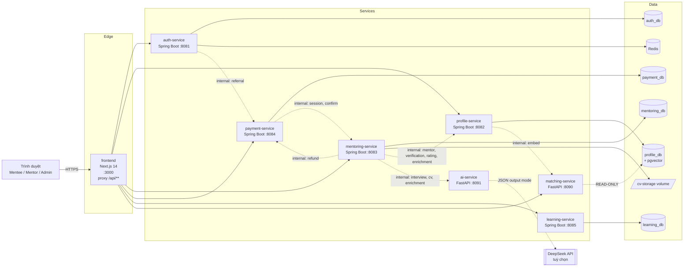
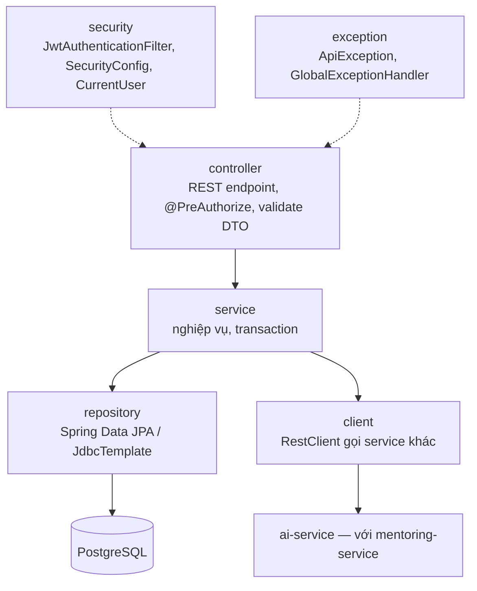
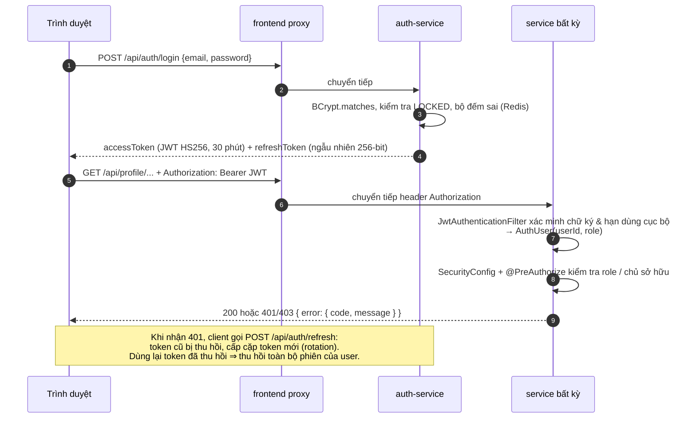
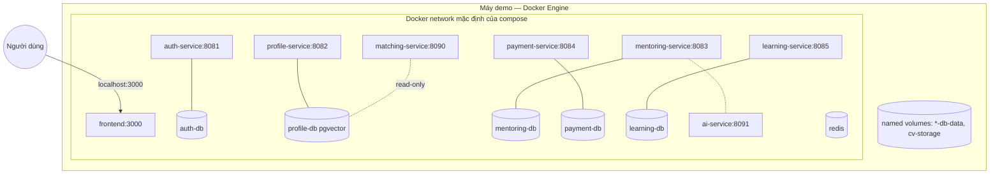

# Thiết kế kiến trúc hệ thống — MentorHub

Tài liệu dùng cho chương **Phân tích & thiết kế hệ thống** của báo cáo. Các sơ đồ viết bằng
[Mermaid](https://mermaid.js.org) — hiển thị trực tiếp trên GitHub/VS Code, hoặc xuất ảnh bằng
<https://mermaid.live> để chèn vào báo cáo Word.

## 1. Tổng quan

MentorHub được xây dựng theo **kiến trúc microservices**: mỗi miền nghiệp vụ là một service độc lập
có CSDL riêng, triển khai bằng một container riêng. Các service giao tiếp đồng bộ qua REST/JSON theo
hợp đồng OpenAPI định nghĩa trước (contract-first).



### 1.1 Trách nhiệm từng service

| Service | Công nghệ | Trách nhiệm | Dữ liệu sở hữu |
|---|---|---|---|
| **frontend** | Next.js 14 | Giao diện 3 vai trò; route handler proxy `/api/<service>/**` tới service tương ứng | — |
| **auth-service** | Spring Boot | Đăng ký, đăng nhập, JWT, refresh token, xác thực email, quản lý tài khoản, admin khoá tài khoản, chống brute-force | `users`, `refresh_tokens`; bộ đếm đăng nhập sai (Redis) |
| **profile-service** | Spring Boot | Hồ sơ mentor/mentee, lịch rảnh, trạng thái xác thực mentor, sinh & lưu embedding, job retry embedding | `mentor_profiles`, `mentee_profiles`, `mentor_availability` |
| **matching-service** | FastAPI | Sinh embedding (model sentence-transformers); pipeline top-K → hard filter → re-rank → explain | Không có DB riêng; đọc read-only DB của profile-service |
| **mentoring-service** | Spring Boot | Yêu cầu mentoring, đặt lịch, đánh giá, thông báo, nhắc lịch; luồng nghiệp vụ & lưu trạng thái của **AI Interview** và **CV Parsing + Chatbot enrichment** (gọi ai-service) | `mentoring_requests`, `sessions`, `reviews`, `notifications`, `interviews`, `interview_turns`, `cv_documents`, `enrichment_*`; file CV |
| **ai-service** | FastAPI | Tính toán AI hội thoại, **không lưu trạng thái**: sinh/chấm câu hỏi phỏng vấn, đọc & parse CV (pypdf), chatbot enrichment; engine DeepSeek + rule-based fallback; chỉ có endpoint `/internal/*` | Không có CSDL |
| **payment-service** | Spring Boot | Thanh toán qua cổng sandbox, hoàn tiền, đối soát; referral & điểm thưởng | `transactions`, `referral_codes`, `referrals`, `reward_ledger` |
| **learning-service** | Spring Boot | Khoá học, tài liệu, roadmap, tiến độ, quản trị nội dung | `courses`, `course_materials`, `course_enrollments`, `material_completions`, `course_progress`, `roadmaps`, `roadmap_items`, `roadmap_item_progress` |

### 1.2 Lý do chọn microservices

| Tiêu chí | Lợi ích trong đồ án |
|---|---|
| Phân chia theo người phụ trách | Mỗi thành viên sở hữu 2 service → làm việc song song, chấm điểm cá nhân rõ ràng |
| Đa ngôn ngữ | matching-service và ai-service dùng Python (hệ sinh thái ML/LLM), phần nghiệp vụ dùng Java/Spring |
| Cô lập lỗi | matching-service lỗi → lưu hồ sơ vẫn thành công (embedding được retry sau) |
| Mở rộng độc lập | Có thể scale riêng matching-service (tốn CPU) mà không ảnh hưởng service khác |

Đánh đổi đã chấp nhận: phức tạp hơn khi triển khai và gỡ lỗi; nhất quán dữ liệu giữa service là
*eventual consistency* (xử lý bằng retry/đối soát — mục 4).

## 2. Kiến trúc bên trong mỗi service

### 2.1 Service Java (Spring Boot) — kiến trúc phân lớp



Cấu trúc thư mục chuẩn (ví dụ mentoring-service):

```
mentoring-service/src/main/java/com/mmp/mentoring/
  controller/     MentoringController, InterviewController, CvEnrichmentController, InternalMentoringController
  service/        MentoringRequestService, SessionService, BookingRules, SessionScheduler,
                  InterviewService, CvEnrichmentService, CvStorage, NotificationService
  client/         ProfileClient, PaymentClient, AiClient + AiModels (hợp đồng với ai-service)
  entity/ repository/ dto/ security/ exception/
```

Nguyên tắc:
- **Không giữ transaction khi gọi mạng**: các thao tác gọi AI/service khác chạy ngoài transaction,
  chỉ bước ghi DB chạy trong `TransactionTemplate` (tránh giữ kết nối DB lâu).
- **Hàm nghiệp vụ thuần** (ví dụ `BookingRules`, `ReferralService.onSuccessfulTransaction`,
  engine rule-based) tách khỏi I/O để kiểm thử đơn vị.
- **Schema do SQL quản lý** (`db/init/*.sql`); Hibernate đặt `ddl-auto: none`.

### 2.2 matching-service (FastAPI)

```
matching-service/app/
  main.py                 khởi tạo app, load model lúc startup, chuẩn hoá lỗi
  config.py db.py security.py
  routers/embed.py        POST /internal/embed
  routers/matching.py     GET  /api/matching/mentors
  services/embedding_service.py   SentenceTransformer (load 1 lần)
  services/matching_pipeline.py   top_k_retrieval → hard_filter → re_rank → explain
  schemas/matching.py     Pydantic model, alias camelCase
```

### 2.3 ai-service (FastAPI)

```
ai-service/app/
  main.py                    app, health, chuẩn hoá lỗi { error: { code, message } }
  config.py security.py      biến môi trường DEEPSEEK_*, xác thực X-Internal-Token
  engines.py                 chọn engine DEEPSEEK / RULE_BASED cho từng yêu cầu
  llm/deepseek.py            client DeepSeek (httpx, JSON Output mode, retry, validate Pydantic)
  interview/                 question_bank.py, rule_based.py, deepseek_engine.py, models.py   (Thắng)
  cv/                        extractor.py (pypdf), skills.py, rule_based.py, deepseek_parser.py (Quang)
  enrichment/                rule_based.py, deepseek_engine.py, models.py                     (Quang)
  routers/                   interview.py, cv.py, enrichment.py
tests/                       41 test (pytest, httpx.MockTransport giả lập DeepSeek)
```

Không lưu trạng thái: mọi dữ liệu (buổi phỏng vấn, hội thoại, file CV) nằm ở mentoring-service; mỗi
lượt gửi kèm lịch sử. Mỗi engine DeepSeek trả `(kết quả, fallback_used)` — lỗi LLM chỉ làm lượt đó dùng
rule-based chứ không làm hỏng nghiệp vụ.

### 2.4 Frontend (Next.js App Router)

```
frontend/src/
  app/api/[service]/[...path]/route.js   proxy tới microservice (đọc URL lúc runtime)
  app/<route>/page.js                    25 trang: auth, dashboard, profile, cv-enrichment, interview,
                                         matching, mentors/[id], mentoring/*, payment/[sessionId],
                                         learning/*, referral, notifications, account, admin/*
  features/<auth|profile|matching|learning|mentoring|payment>/api.js   hàm gọi API theo ownership
  lib/api.js (fetch + tự refresh token) · lib/auth.js (AuthContext) · components/ (Nav, Footer, RequireAuth, ui)
  app/globals.css                        giao diện theo design tokens (Tailwind CSS v4 + tailwind/theme.css)
```

Giao diện theo design system trong `frontend/DESIGN.md`, `tokens.json`, `tailwind/theme.css` — chi tiết:
[ui-design.md](ui-design.md).

## 3. Bảo mật

### 3.1 Xác thực & phân quyền



| Cơ chế | Chi tiết |
|---|---|
| Lưu mật khẩu | BCrypt (Spring Security) |
| Access token | JWT HS256, claims `sub`, `email`, `role`, `typ=access`, hạn 30 phút; secret dùng chung `JWT_SECRET` |
| Refresh token | Chuỗi ngẫu nhiên 256-bit, DB chỉ lưu SHA-256, hạn 7 ngày, xoay vòng mỗi lần dùng |
| Chống brute-force | 5 lần sai liên tiếp → chặn email 15 phút (Redis, tự fallback bộ nhớ trong nếu Redis lỗi) |
| Thu hồi | Đổi mật khẩu / bị khoá ⇒ thu hồi mọi refresh token; access token hết hạn tối đa sau 30 phút |
| Phân quyền | Role `MENTEE`, `MENTOR`, `ADMIN` (+ `INTERNAL` cho service); `@PreAuthorize` theo role, `CurrentUser.requireAccess(ownerId)` theo chủ sở hữu |
| Service-to-service | Header `X-Internal-Token` (so sánh hằng thời gian); `/internal/**` chỉ chấp nhận role INTERNAL; proxy frontend chỉ chuyển tiếp `/api/<service>/**` nên không thể gọi `/internal/**` từ trình duyệt |
| CSDL | matching-service dùng role `matching_reader` chỉ có quyền SELECT |
| Upload file | Kiểm tra chữ ký `%PDF-`, ≤ 5MB, ≤ 10 trang; đường dẫn lưu trữ được chuẩn hoá chống path traversal |
| Thanh toán | Số tiền lấy từ server (giá phiên), unique index chỉ 1 giao dịch SUCCESS/phiên |
| AI | ai-service chỉ nhận lời gọi nội bộ (không đi qua proxy frontend); DEEPSEEK_API_KEY chỉ nằm ở ai-service; nội dung người dùng đặt trong thẻ `<answer>`/`<cv>`, prompt yêu cầu coi là dữ liệu, bỏ qua chỉ dẫn bên trong; JSON trả về được validate & kẹp miền giá trị; kết quả phỏng vấn luôn cần admin duyệt |

### 3.2 Format lỗi thống nhất

```json
{ "error": { "code": "MENTOR_NOT_AVAILABLE", "message": "Mentor không rảnh vào thời điểm này..." } }
```

HTTP status: 400 dữ liệu sai / vi phạm quy tắc, 401 chưa đăng nhập, 403 không đủ quyền, 404 không tìm
thấy, 409 xung đột trạng thái, 429 quá nhiều lần thử, 502/503 service phụ thuộc lỗi.

## 4. Nhất quán dữ liệu giữa các service

Mỗi service có CSDL riêng nên không dùng transaction phân tán. Hệ thống áp dụng các kỹ thuật sau:

| Tình huống | Kỹ thuật | Cài đặt |
|---|---|---|
| Lưu hồ sơ nhưng matching-service lỗi khi sinh embedding | Đánh dấu cần retry + job nền | `embedding_text_hash = NULL`; `EmbeddingRetryJob` chạy mỗi phút |
| Thanh toán thành công nhưng báo xác nhận phiên thất bại | Cờ đồng bộ + job đối soát | `transactions.session_synced`; `PaymentReconciliationJob` mỗi phút |
| Tiền về sau khi phiên đã tự huỷ | Bù trừ (compensation) | `SessionService.markPaid` gọi hoàn tiền ngay |
| ai-service / DeepSeek lỗi giữa buổi phỏng vấn hoặc hội thoại | Fallback + gọi AI trước khi ghi | DeepSeek lỗi → ai-service dùng rule-based cho lượt đó; ai-service không phản hồi → mentoring-service trả 502 trước khi ghi DB, người dùng gửi lại được |
| Chatbot hoàn tất nhưng cập nhật hồ sơ lỗi | Cờ đồng bộ + job | `enrichment_conversations.profile_synced`; `retryProfileSync` mỗi 2 phút |
| Huỷ phiên đã thanh toán | Hoàn tiền trước, huỷ sau | Nếu hoàn tiền lỗi → trả 502, phiên không bị huỷ |
| Hai mentee đặt cùng khung giờ | Khoá tư vấn (advisory lock) theo mentor | `pg_advisory_xact_lock(hashtext(mentorId))` trong transaction tạo phiên |
| Thanh toán trùng đồng thời | Ràng buộc CSDL | Unique partial index `(session_id) WHERE status='SUCCESS'` |
| Sức chứa & rating dùng cho matching | Đồng bộ chủ động | mentoring-service gọi `/internal/mentor/{id}/active-mentees`, `/rating` sau mỗi thay đổi |

## 5. Tác vụ nền

| Service | Job | Chu kỳ | Mục đích |
|---|---|---|---|
| profile-service | `EmbeddingRetryJob` | 1 phút | Sinh lại embedding cho hồ sơ bị lỗi |
| mentoring-service | `SessionScheduler.sendReminders` | 1 phút | FR-5.5 nhắc lịch phiên CONFIRMED trong 24 giờ tới |
| mentoring-service | `SessionScheduler.expireUnpaidSessions` | 1 phút | Huỷ phiên PENDING quá 30 phút |
| mentoring-service | `SessionScheduler.autoCompleteFinishedSessions` | 5 phút | Hoàn thành phiên đã kết thúc > 2 giờ |
| mentoring-service | `CvEnrichmentService.retryProfileSync` | 2 phút | Đồng bộ goal chưa gửi được |
| payment-service | `PaymentReconciliationJob` | 1 phút | Gửi lại xác nhận phiên sau thanh toán |

## 6. Triển khai



- Mỗi service Java build bằng Dockerfile multi-stage (`maven:3.9-eclipse-temurin-21` → `eclipse-temurin:21-jre-alpine`).
- matching-service cài PyTorch bản CPU và tải sẵn model vào image (khởi động không cần Internet).
- ai-service là image `python:3.11-slim` nhẹ (FastAPI, httpx, pypdf); chỉ cần Internet khi bật DeepSeek.
- frontend build `output: standalone` → image Node 20 alpine.
- Mọi service có healthcheck; service phụ thuộc chỉ khởi động khi CSDL `healthy`.
- Cấu hình qua biến môi trường (`.env`, xem `.env.example`): `JWT_SECRET`, `INTERNAL_API_KEY`,
  `DEEPSEEK_API_KEY`, `DEEPSEEK_BASE_URL`, `DEEPSEEK_MODEL`, `ADMIN_EMAIL`, `ADMIN_PASSWORD`, `REMINDER_BEFORE`,
  `INTERVIEW_MAX_TURNS`, `ENRICHMENT_MAX_TURNS`.

Hướng dẫn chạy chi tiết: [deployment-guide.md](deployment-guide.md).

## 7. CI/CD

GitHub Actions (`.github/workflows/ci.yml`):

1. **java-services** (matrix 5 service): `mvn -B package` — biên dịch + chạy unit test.
2. **matching-service**: cài PyTorch CPU + `pytest`.
3. **ai-service**: `pytest` (không cần API key — DeepSeek được giả lập).
4. **frontend**: `npm install` + `npm run build`.
5. **e2e** (sau khi 4 job trên pass): `docker compose up -d --build --wait` → `seed_demo.py` →
   `e2e_acceptance.py` (kiểm thử theo Definition of Done); in log service nếu thất bại.
