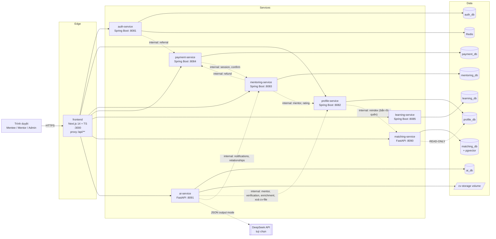
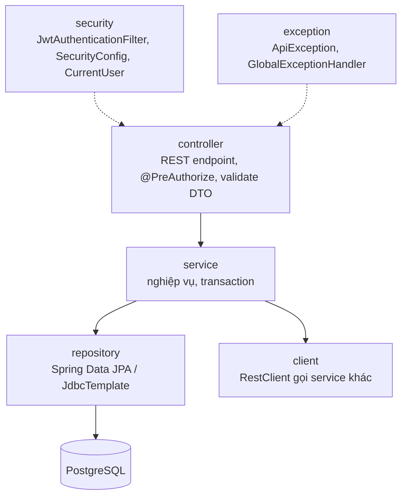
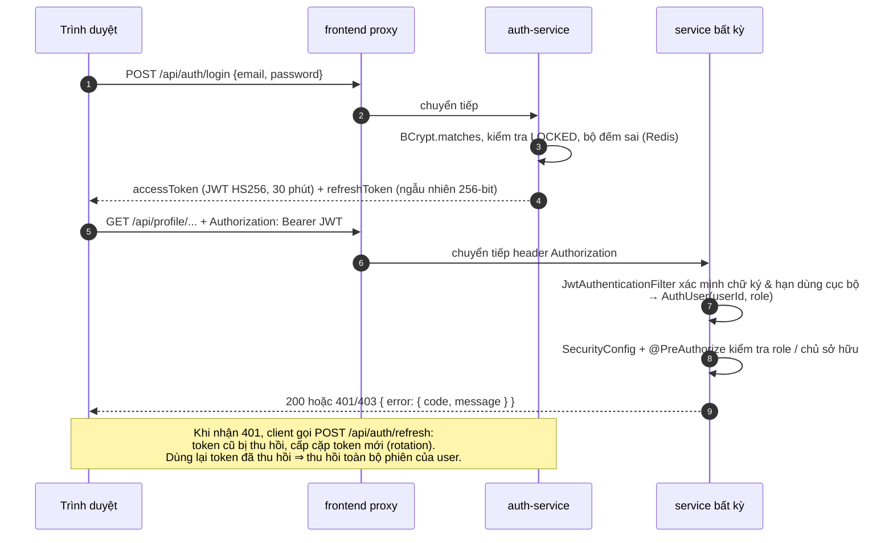
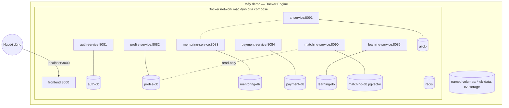

# Thiết kế kiến trúc hệ thống — MentorHub

Tài liệu dùng cho chương **Phân tích & thiết kế hệ thống** của báo cáo. Các sơ đồ viết bằng
[Mermaid](https://mermaid.js.org) — hiển thị trực tiếp trên GitHub/VS Code, hoặc xuất ảnh bằng
<https://mermaid.live> để chèn vào báo cáo Word.

## 1. Tổng quan

MentorHub được xây dựng theo **kiến trúc microservices**: mỗi miền nghiệp vụ là một service độc lập
có CSDL riêng, triển khai bằng một container riêng. Các service giao tiếp đồng bộ qua REST/JSON theo
hợp đồng OpenAPI định nghĩa trước (contract-first).


```mermaid
flowchart LR
    U[Trình duyệt<br/>Mentee / Mentor / Admin] -->|HTTPS| FE

    subgraph Edge
      FE[frontend<br/>Next.js 14 + TS<br/>:3000<br/>proxy /api/**]
    end

    subgraph Services
      AUTH[auth-service<br/>Spring Boot :8081]
      PROF[profile-service<br/>Spring Boot :8082]
      MENT[mentoring-service<br/>Spring Boot :8083]
      PAY[payment-service<br/>Spring Boot :8084]
      LEARN[learning-service<br/>Spring Boot :8085]
      MATCH[matching-service<br/>FastAPI :8090]
      AIS[ai-service<br/>FastAPI :8091]
    end

    subgraph Data
      ADB[(auth_db)]
      PDB[(profile_db)]
      MADB[(matching_db<br/>+ pgvector)]
      MDB[(mentoring_db)]
      PYDB[(payment_db)]
      LDB[(learning_db)]
      AIDB[(ai_db)]
      REDIS[(Redis)]
      VOL[/cv-storage volume/]
    end

    DEEPSEEK[[DeepSeek API<br/>tuỳ chọn]]

    FE --> AUTH & PROF & MENT & PAY & LEARN & MATCH & AIS
    AUTH --> ADB
    AUTH --> REDIS
    AUTH -. internal: referral .-> PAY
    PROF --> PDB
    PROF -. internal: reindex (bắn rồi quên) .-> MATCH
    MATCH --> MADB
    MATCH -. READ-ONLY .-> PDB
    MENT --> MDB
    MENT -. internal: mentor, rating .-> PROF
    MENT -. internal: refund .-> PAY
    AIS --> AIDB
    AIS --> VOL
    AIS -. internal: mentor, verification, enrichment, xoá cv-file .-> PROF
    AIS -. internal: notifications, relationships .-> MENT
    AIS -. JSON output mode .-> DEEPSEEK
    PAY --> PYDB
    PAY -. internal: session, confirm .-> MENT
    LEARN --> LDB
```

### 1.1 Trách nhiệm từng service

| Service | Công nghệ | Trách nhiệm | Dữ liệu sở hữu |
|---|---|---|---|
| **frontend** | Next.js 14 + TypeScript | Giao diện 3 vai trò; route handler proxy `/api/<service>/**` tới service tương ứng | — |
| **auth-service** | Spring Boot | Đăng ký, đăng nhập, JWT, refresh token, xác thực email, quản lý tài khoản, admin khoá tài khoản, chống brute-force | `users`, `refresh_tokens`; bộ đếm đăng nhập sai (Redis) |
| **profile-service** | Spring Boot | Hồ sơ mentor/mentee, lịch rảnh, trạng thái xác thực mentor. Không giữ dữ liệu embedding — chỉ báo matching-service khi hồ sơ đổi | `mentor_profiles`, `mentee_profiles`, `mentor_availability` |
| **matching-service** | FastAPI | Sở hữu trọn chỉ mục embedding (chuẩn hoá text, chạy model sentence-transformers, lưu vector, job đồng bộ); pipeline top-K → hard filter → re-rank → explain | `mentor_embeddings`, `mentee_embeddings` (matching_db); đọc read-only DB của profile-service |
| **mentoring-service** | Spring Boot | Yêu cầu mentoring, đặt lịch, đánh giá, thông báo, nhắc lịch | `mentoring_requests`, `sessions`, `reviews`, `notifications` |
| **ai-service** | FastAPI | **Toàn bộ 3 tính năng AI hội thoại/văn bản** — luồng nghiệp vụ lẫn dữ liệu: AI Interview (sinh/chấm câu hỏi, tổng hợp đánh giá, admin duyệt), CV Parsing (pypdf), chatbot enrichment; engine DeepSeek + rule-based fallback | `interviews`, `interview_turns`, `cv_documents`, `enrichment_conversations`, `enrichment_messages`; file CV |
| **payment-service** | Spring Boot | Thanh toán qua cổng sandbox, hoàn tiền, đối soát; referral & điểm thưởng | `transactions`, `referral_codes`, `referrals`, `reward_ledger` |
| **learning-service** | Spring Boot | Khoá học, tài liệu, roadmap, tiến độ, quản trị nội dung | `courses`, `course_materials`, `course_enrollments`, `material_completions`, `course_progress`, `roadmaps`, `roadmap_items`, `roadmap_item_progress` |

### 1.2 Lý do chọn microservices

| Tiêu chí | Lợi ích trong đồ án |
|---|---|
| Phân chia theo người phụ trách | Mỗi thành viên sở hữu 2 service → làm việc song song, chấm điểm cá nhân rõ ràng |
| Đa ngôn ngữ | matching-service và ai-service dùng Python (hệ sinh thái ML/LLM), phần nghiệp vụ còn lại dùng Java/Spring; mọi logic AI nằm trọn trong Python nên thay model/prompt không đụng tới code Java |
| Cô lập lỗi | matching-service lỗi → lưu hồ sơ vẫn thành công (profile-service không chờ kết quả lập chỉ mục; `IndexSyncJob` bắt kịp sau) |
| Mở rộng độc lập | Có thể scale riêng matching-service (tốn CPU) mà không ảnh hưởng service khác |

Đánh đổi đã chấp nhận: phức tạp hơn khi triển khai và gỡ lỗi; nhất quán dữ liệu giữa service là
*eventual consistency* (xử lý bằng retry/đối soát — mục 4).

## 2. Kiến trúc bên trong mỗi service

### 2.1 Service Java (Spring Boot) — kiến trúc phân lớp


```mermaid
flowchart TB
    C[controller<br/>REST endpoint, @PreAuthorize, validate DTO] --> S[service<br/>nghiệp vụ, transaction]
    S --> R[repository<br/>Spring Data JPA / JdbcTemplate]
    S --> CL[client<br/>RestClient gọi service khác]
    R --> DB[(PostgreSQL)]
    SEC[security<br/>JwtAuthenticationFilter, SecurityConfig, CurrentUser] -.-> C
    EX[exception<br/>ApiException, GlobalExceptionHandler] -.-> C
```

Cấu trúc thư mục chuẩn (ví dụ mentoring-service):

```
mentoring-service/src/main/java/com/mmp/mentoring/
  controller/     MentoringController, InternalMentoringController, InternalNotificationController
  service/        MentoringRequestService, SessionService, BookingRules, SessionScheduler,
                  NotificationService
  client/         ProfileClient, PaymentClient
  entity/ repository/ dto/ security/ exception/
```

Nguyên tắc:
- **Không giữ transaction khi gọi mạng**: các thao tác gọi AI/service khác chạy ngoài transaction,
  chỉ bước ghi DB chạy trong `TransactionTemplate` (tránh giữ kết nối DB lâu).
- **Hàm nghiệp vụ thuần** (ví dụ `BookingRules`, `ReferralService.onSuccessfulTransaction`,
  engine rule-based) tách khỏi I/O để kiểm thử đơn vị.
- **Schema do SQL quản lý** (`db/init/*.sql`); Hibernate đặt `ddl-auto: none`.

### 2.2 matching-service (FastAPI)

```
matching-service/app/
  main.py                 khởi tạo app, load model lúc startup, chạy IndexSyncJob, chuẩn hoá lỗi
  config.py security.py
  db.py                   2 pool: matching_db (read-write) + profile_db (read-only)
  routers/index.py        POST /internal/embeddings/reindex, GET /api/matching/index-status,
                          POST /api/matching/admin/embeddings/rebuild
  routers/matching.py     GET  /api/matching/mentors
  services/embedding_service.py   SentenceTransformer (load 1 lần)
  services/profile_text.py        chuẩn hoá hồ sơ → text + SHA-256 (NFR-7)
  services/index_service.py       vòng đời chỉ mục: reindex / status / reconcile / rebuild
  services/matching_pipeline.py   top_k_retrieval → hard_filter → re_rank → explain
  jobs/index_sync.py      đồng bộ chỉ mục với profile_db theo chu kỳ
  schemas/matching.py     Pydantic model, alias camelCase
```

### 2.3 ai-service (FastAPI)

```
ai-service/app/
  main.py                    app, lifespan (pool CSDL, job đồng bộ lại profile), health, chuẩn hoá lỗi
  config.py security.py      biến môi trường; xác minh JWT (/api/ai/**) và X-Internal-Token (/internal/**)
  db.py                      pool asyncpg tới ai_db
  storage.py                 lưu/đọc file CV trên volume
  clients/                   profile.py (hồ sơ, xác thực mentor, enrichment), mentoring.py (thông báo)
  engines.py                 chọn engine DEEPSEEK / RULE_BASED cho từng yêu cầu
  llm/deepseek.py            client DeepSeek (httpx, JSON Output mode, retry, validate Pydantic)
  interview/                 question_bank, rule_based, deepseek_engine, engine, repository,
                             service, views, models                                           (Thắng)
  cv/                        extractor (pypdf), skills, rule_based, deepseek_parser, engine,
                             repository, models                                               (Quang)
  enrichment/                rule_based, deepseek_engine, engine, repository, service, views   (Quang)
  routers/                   interview.py, cv.py, enrichment.py  (tất cả dưới /api/ai/**)
tests/                       pytest (httpx.MockTransport giả lập DeepSeek, Postgres thật cho
                             luồng có trạng thái — không có Postgres thì các test đó tự skip)
```

Nguyên tắc giống phía Java: gọi engine/LLM **trước** rồi mới mở transaction ghi kết quả; lượt trả lời
được ghi bằng `UPDATE ... WHERE answer IS NULL` để chống gửi trùng.

Dữ liệu (buổi phỏng vấn, hội thoại, metadata CV) nằm trong `ai_db` của chính ai-service; file CV nằm
trên volume `cv-storage` (chính sách: [cv-data-policy.md](cv-data-policy.md)). Mỗi engine DeepSeek trả
`(kết quả, fallback_used)` — lỗi LLM chỉ làm lượt đó dùng rule-based chứ không làm hỏng nghiệp vụ.

### 2.4 Frontend (Next.js 14 + TypeScript, App Router)

```
frontend/src/
  app/api/[service]/[...path]/route   proxy tới microservice (đọc URL lúc runtime)
  app/<route>/page                    26 trang: auth, dashboard, profile, cv-enrichment, interview,
                                      matching, mentors (duyệt danh sách mentor), mentors/[id],
                                      mentoring/*, payment/[sessionId], learning/*, referral,
                                      notifications, account, admin/*
  features/<auth|profile|matching|learning|mentoring|payment|ai>/api   hàm gọi API theo ownership
  lib/api (fetch + tự refresh token) · lib/auth (AuthContext) · components/ (Nav, Footer, RequireAuth, ui)
  app/globals.css                     giao diện theo design tokens (Tailwind CSS v4 + tailwind/theme.css)
```

Font Nunito / Nunito Sans được **tự host** qua gói npm `@fontsource` (file woff2 đóng gói lúc build) —
không tải từ Google Fonts, nên `next build` không cần mạng ngoài bước `npm install`.

Giao diện theo design system trong `frontend/DESIGN.md`, `tokens.json`, `tailwind/theme.css` — chi tiết:
[ui-design.md](ui-design.md).

## 3. Bảo mật

### 3.1 Xác thực & phân quyền


```mermaid
sequenceDiagram
    autonumber
    participant B as Trình duyệt
    participant F as frontend proxy
    participant A as auth-service
    participant S as service bất kỳ
    B->>F: POST /api/auth/login {email, password}
    F->>A: chuyển tiếp
    A->>A: BCrypt.matches, kiểm tra LOCKED, bộ đếm sai (Redis)
    A-->>B: accessToken (JWT HS256, 30 phút) + refreshToken (ngẫu nhiên 256-bit)
    B->>F: GET /api/profile/... + Authorization: Bearer JWT
    F->>S: chuyển tiếp header Authorization
    S->>S: JwtAuthenticationFilter xác minh chữ ký & hạn dùng cục bộ<br/>→ AuthUser(userId, role)
    S->>S: SecurityConfig + @PreAuthorize kiểm tra role / chủ sở hữu
    S-->>B: 200 hoặc 401/403 { error: { code, message } }
    Note over B,A: Khi nhận 401, client gọi POST /api/auth/refresh:<br/>token cũ bị thu hồi, cấp cặp token mới (rotation).<br/>Dùng lại token đã thu hồi ⇒ thu hồi toàn bộ phiên của user.
```

| Cơ chế | Chi tiết |
|---|---|
| Lưu mật khẩu | BCrypt (Spring Security) |
| Access token | JWT HS256, claims `sub`, `email`, `role`, `typ=access`, hạn 30 phút; secret dùng chung `JWT_SECRET` |
| Refresh token | Chuỗi ngẫu nhiên 256-bit, DB chỉ lưu SHA-256, hạn 7 ngày, xoay vòng mỗi lần dùng |
| Chống brute-force | 5 lần sai liên tiếp → chặn email 15 phút (Redis, tự fallback bộ nhớ trong nếu Redis lỗi) |
| Thu hồi | Đổi mật khẩu / bị khoá ⇒ thu hồi mọi refresh token; access token hết hạn tối đa sau 30 phút |
| Phân quyền | Role `MENTEE`, `MENTOR`, `ADMIN` (+ `INTERNAL` cho service); `@PreAuthorize` theo role, `CurrentUser.requireAccess(ownerId)` theo chủ sở hữu |
| Service-to-service | Header `X-Internal-Token` (so sánh hằng thời gian); `/internal/**` chỉ chấp nhận role INTERNAL; proxy frontend chỉ chuyển tiếp `/api/<service>/**` nên không thể gọi `/internal/**` từ trình duyệt |
| CSDL | matching-service dùng role `matching_reader` chỉ có quyền SELECT |
| Upload file | Kiểm tra chữ ký `%PDF-`, ≤ 5MB, ≤ 10 trang; đường dẫn lưu trữ được chuẩn hoá chống path traversal |
| Dữ liệu CV | Tải file: chủ CV, admin, nội bộ, hoặc mentor có yêu cầu mentoring `PENDING`/`ACCEPTED` với chủ CV — ai-service hỏi `GET /internal/relationships` của mentoring-service (timeout 3 s), lỗi ⇒ 403 (*fail-closed*). Chủ CV/admin xoá được CV (`DELETE /api/ai/cv/{id}`). Chi tiết: [cv-data-policy.md](cv-data-policy.md) |
| Bí mật mặc định | Cả 7 service ghi log **WARN** lúc khởi động nếu `JWT_SECRET` / `INTERNAL_API_KEY` còn đúng giá trị dev mặc định trong code (`DevSecretsWarning` ở 5 service Java, `config.dev_secret_warnings()` ở 2 service Python). NFR-9 (US-10): auth-service, learning-service (Spring profile `prod`) và ai-service (`APP_ENV=prod`) **từ chối khởi động** khi còn giá trị dev |
| Thanh toán | Số tiền lấy từ server (giá phiên), unique index chỉ 1 giao dịch SUCCESS/phiên |
| AI | `/api/ai/**` yêu cầu JWT như mọi service khác, `/internal/**` chỉ nhận X-Internal-Token; DEEPSEEK_API_KEY chỉ nằm ở ai-service; nội dung người dùng đặt trong thẻ `<answer>`/`<cv>`, prompt yêu cầu coi là dữ liệu, bỏ qua chỉ dẫn bên trong; JSON trả về được validate & kẹp miền giá trị; kết quả phỏng vấn luôn cần admin duyệt |

### 3.2 Format lỗi thống nhất

```json
{ "error": { "code": "MENTOR_NOT_AVAILABLE", "message": "Mentor không rảnh vào thời điểm này..." } }
```

HTTP status: 400 dữ liệu sai / vi phạm quy tắc, 401 chưa đăng nhập, 403 không đủ quyền, 404 không tìm
thấy, 409 xung đột trạng thái, 429 quá nhiều lần thử, 502/503 service phụ thuộc lỗi.

## 4. Nhất quán dữ liệu giữa các service

Mỗi service có CSDL riêng nên không dùng transaction phân tán. Hệ thống áp dụng các kỹ thuật sau:

| Tình huống | Kỹ thuật | Cài đặt |
|---|---|---|
| Lưu hồ sơ nhưng matching-service lỗi/đang down | Thông báo best-effort + job đối soát theo hash | profile-service gọi `/internal/embeddings/reindex` và không chờ kết quả; `IndexSyncJob` so SHA-256 của text hồ sơ với `text_hash` trong chỉ mục mỗi phút và embed lại phần lệch |
| Mentee tìm mentor trước khi chỉ mục kịp cập nhật | Lập chỉ mục ngay trong request | `/api/matching/mentors` thấy hồ sơ **mentee** chưa có vector thì embed tại chỗ thay vì trả 404 (mentor mới vẫn chờ thông báo hoặc `IndexSyncJob`) |
| Hồ sơ bị xoá nhưng vector còn trong chỉ mục | Dọn rác định kỳ | `IndexSyncJob` xoá dòng chỉ mục không còn hồ sơ tương ứng (2 DB nên không có FK) |
| Thanh toán thành công nhưng báo xác nhận phiên thất bại | Cờ đồng bộ + job đối soát | `transactions.session_synced`; `PaymentReconciliationJob` mỗi phút |
| Tiền về sau khi phiên đã tự huỷ | Bù trừ (compensation) | `SessionService.markPaid` gọi hoàn tiền ngay |
| DeepSeek lỗi giữa buổi phỏng vấn hoặc hội thoại | Fallback + gọi engine trước khi ghi | DeepSeek lỗi → dùng rule-based cho lượt đó; engine không sinh được câu hỏi → 502 `AI_ENGINE_UNAVAILABLE`, transaction rollback nên người dùng gửi lại được |
| profile-service lỗi khi đồng bộ goal sau enrichment | Job thử lại trong ai-service | Hội thoại vẫn COMPLETED với `profileSynced = false`; job nền định kỳ gọi lại `/api/profile/mentee/{id}/enrichment-chat` |
| Chatbot hoàn tất nhưng cập nhật hồ sơ lỗi | Cờ đồng bộ + job | `enrichment_conversations.profile_synced`; `retryProfileSync` mỗi 2 phút |
| Huỷ phiên đã thanh toán | Hoàn tiền trước, huỷ sau | Nếu hoàn tiền lỗi → trả 502, phiên không bị huỷ |
| Hai mentee đặt cùng khung giờ | Khoá tư vấn (advisory lock) theo mentor | `pg_advisory_xact_lock(hashtext(mentorId))` trong transaction tạo phiên |
| Thanh toán trùng đồng thời | Ràng buộc CSDL | Unique partial index `(session_id) WHERE status='SUCCESS'` |
| Sức chứa & rating dùng cho matching | Đồng bộ chủ động | mentoring-service gọi `/internal/mentor/{id}/active-mentees`, `/rating` sau mỗi thay đổi |

## 5. Tác vụ nền

| Service | Job | Chu kỳ | Mục đích |
|---|---|---|---|
| matching-service | `IndexSyncJob` (`jobs/index_sync.py`) | 60 giây (`INDEX_SYNC_INTERVAL`) | Embed lại hồ sơ có text lệch hash, dọn chỉ mục mồ côi |
| mentoring-service | `SessionScheduler.sendReminders` | 1 phút | FR-5.5 nhắc lịch phiên CONFIRMED trong 24 giờ tới |
| mentoring-service | `SessionScheduler.expireUnpaidSessions` | 1 phút | Huỷ phiên PENDING quá 30 phút |
| mentoring-service | `SessionScheduler.autoCompleteFinishedSessions` | 5 phút | Hoàn thành phiên đã kết thúc > 2 giờ |
| ai-service | `enrichment.service.retry_profile_sync_forever` | 2 phút | Đồng bộ goal chưa gửi được sang profile-service |
| payment-service | `PaymentReconciliationJob` | 1 phút | Gửi lại xác nhận phiên sau thanh toán |

## 6. Triển khai


```mermaid
flowchart TB
    subgraph Host[Máy demo — Docker Engine]
      subgraph net[Docker network mặc định của compose]
        fe[frontend:3000]
        a[auth-service:8081] --- adb[(auth-db)]
        p[profile-service:8082] --- pdb[(profile-db)]
        m[mentoring-service:8083] --- mdb[(mentoring-db)]
        pay[payment-service:8084] --- paydb[(payment-db)]
        l[learning-service:8085] --- ldb[(learning-db)]
        mt[matching-service:8090] --- mtdb[(matching-db pgvector)]
        mt -.read-only.- pdb
        ai[ai-service:8091] --- aidb[(ai-db)]
        ai -.- m
        r[(redis)]
      end
      vols[(named volumes: *-db-data, cv-storage)]
    end
    user((Người dùng)) -->|localhost:3000| fe
```

- Mỗi service Java build bằng Dockerfile multi-stage (`maven:3.9-eclipse-temurin-21` → `eclipse-temurin:21-jre-alpine`).
- matching-service cài PyTorch bản CPU và tải sẵn model vào image (khởi động không cần Internet).
- ai-service là image `python:3.11-slim` nhẹ (FastAPI, httpx, pypdf, asyncpg); chỉ cần Internet khi bật DeepSeek.
- frontend (Next.js 14 + TypeScript) build `output: standalone` → image Node 20 alpine.
- Mọi service có healthcheck; service phụ thuộc chỉ khởi động khi CSDL `healthy`.
- Cấu hình qua biến môi trường (`.env`, xem `.env.example`): `JWT_SECRET`, `INTERNAL_API_KEY`,
  `DEEPSEEK_API_KEY`, `DEEPSEEK_BASE_URL`, `DEEPSEEK_MODEL`, `ADMIN_EMAIL`, `ADMIN_PASSWORD`, `REMINDER_BEFORE`,
  `INTERVIEW_MAX_TURNS`, `ENRICHMENT_MAX_TURNS`, `INDEX_SYNC_INTERVAL`.
- **Nâng cấp từ bản trước khi tách quyền sở hữu embedding**: `db/init/*.sql` chỉ chạy khi volume CSDL
  được tạo lần đầu, nên máy đã chạy hệ thống cũ sẽ còn `profile_db` với cột `embedding` và chưa có
  `matching_db`. Chạy `docker compose down -v` rồi `up --build` để khởi tạo lại (mất dữ liệu demo —
  chạy lại `scripts/seed_demo.py`). Quy trình đầy đủ và cách kiểm chứng:
  [deployment-guide.md](deployment-guide.md) §8; lý do không dùng công cụ migration: [adr.md](adr.md) ADR-04.

Hướng dẫn chạy chi tiết: [deployment-guide.md](deployment-guide.md).

## 7. CI/CD

GitHub Actions (`.github/workflows/ci.yml`):

1. **java-services** (matrix 5 service): `mvn -B package` — biên dịch + chạy unit test.
2. **matching-service**: 2 service container — `pgvector/pgvector:pg16` (`matching_db`, :5439) và `postgres:16`
   (`profile_db`, :5434) — cài PyTorch CPU rồi `pytest` với `MATCHING_DB_URL`, `PROFILE_DB_URL` (role
   `matching_reader`), `PROFILE_DB_ADMIN_URL`. `tests/test_index_db.py` tự nạp `db/init/*.sql` và chạy
   `reconcile()` trên Postgres thật; thiếu CSDL khi biến `CI` được đặt thì **FAIL** chứ không skip âm thầm.
3. **ai-service**: `pytest` (không cần API key — DeepSeek được giả lập; luồng có trạng thái chạy trên Postgres của CI).
4. **frontend**: `npm install` + `npm run build`.
5. **e2e** (sau khi 4 job trên pass): `docker compose up -d --build --wait` → `seed_demo.py` →
   `e2e_acceptance.py` (kiểm thử theo Definition of Done); in log service nếu thất bại.

## 8. Hạn chế đã biết

Các điểm dưới đây là **đánh đổi có chủ đích** hoặc nợ kỹ thuật ngoài phạm vi đồ án — nêu trước để trả lời
chủ động khi bảo vệ. Lý do thiết kế chi tiết ở [adr.md](adr.md).

| Hạn chế | Hiện trạng | Rủi ro / hướng xử lý khi triển khai thật |
|---|---|---|
| Chỉ mục embedding **nhất quán cuối cùng** | Hồ sơ mới/sửa thường được lập chỉ mục sau vài giây (thông báo best-effort); nếu thông báo mất thì tối đa ~1 chu kỳ `INDEX_SYNC_INTERVAL` = 60 s (vòng đầu sau khi khởi động chờ tới 30 s; mỗi vòng embed tối đa `INDEX_SYNC_BATCH` = 200 hồ sơ/vai trò) | Có chủ đích (ADR-02, ADR-03); theo dõi bằng `GET /api/matching/index-status`, ép làm ngay bằng `POST /api/matching/admin/embeddings/rebuild` |
| Thanh toán **sandbox** | `SandboxPaymentGateway`, thẻ test; không tích hợp cổng thật | Đã nêu trong phạm vi SRD; tích hợp VNPay/Stripe cần webhook + đối soát |
| Không có **API Gateway** | Proxy Next.js là cổng vào duy nhất (ADR-05) | Không có rate-limit, xác thực, logging tập trung ở biên |
| **Bí mật mặc định cho dev** | `JWT_SECRET`, `INTERNAL_API_KEY` có giá trị fallback trong code — mỗi service log **WARN** lúc khởi động khi còn dùng fallback; auth, learning (profile `prod`) và ai-service (`APP_ENV=prod`) **chặn khởi động** — các service còn lại chưa; giá trị mẫu trong `.env.example` (`change-me-…`) không bị phát hiện. CSDL dùng `postgres/postgres`; role `matching_reader` có mật khẩu hard-code trong `db/init/profile-service.sql`; admin `admin@mmp.local` / `Admin@123` | Bắt buộc đặt qua `.env`/secret manager và đổi mật khẩu role khi triển khai thật; có thể nâng cảnh báo thành chặn khởi động ở profile production |
| Không có **công cụ migration** | `db/init/*.sql` chỉ chạy khi volume mới (ADR-04) | Đổi schema phải `docker compose down -v` (mất dữ liệu) — [deployment-guide.md](deployment-guide.md) §8 |
| Không có **service discovery** | URL service cố định qua biến môi trường | Chấp nhận với Docker Compose |
| Không có **logging/tracing tập trung** | Log stdout từng container | Khó lần vết lỗi xuyên service; cần correlation id + ELK/Loki/OpenTelemetry |
| **Redis** dùng rất ít | Chỉ đếm số lần đăng nhập sai (auth-service), có fallback bộ nhớ trong | Nêu rõ để tránh câu hỏi "vì sao cần Redis" |
| Quản lý **dữ liệu CV** chưa đầy đủ | Đã có xem/xoá CV và giới hạn mentor theo quan hệ mentoring; **còn thiếu**: thời hạn lưu tự động, mã hoá khi lưu, xin đồng ý trước khi gửi DeepSeek; goal/kỹ năng suy ra từ CV không tự gỡ khi xoá CV | [cv-data-policy.md](cv-data-policy.md) §7 |
| `reconcile()` quét toàn bộ hồ sơ mỗi chu kỳ | O(N) mỗi phút | Ổn với vài nghìn hồ sơ; dữ liệu lớn cần quét theo `updated_at` |
