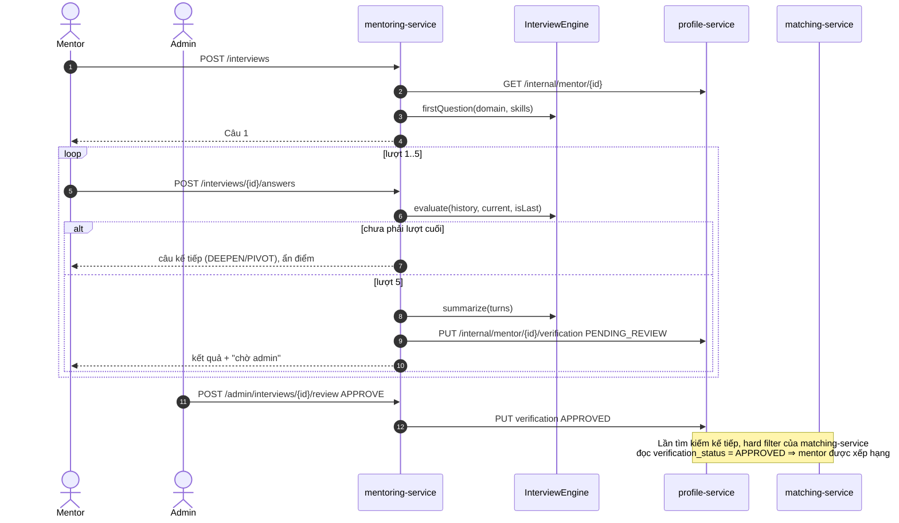
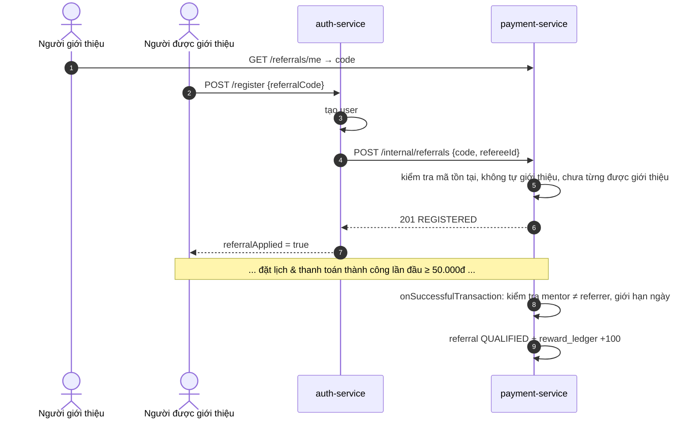
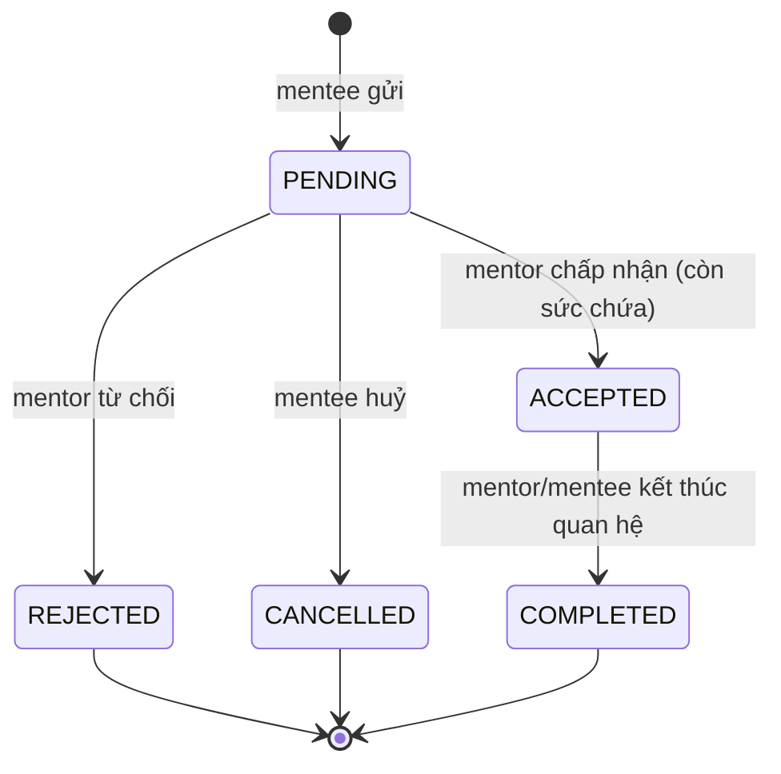
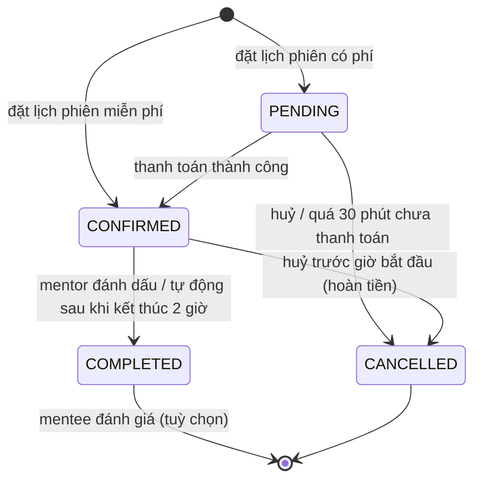
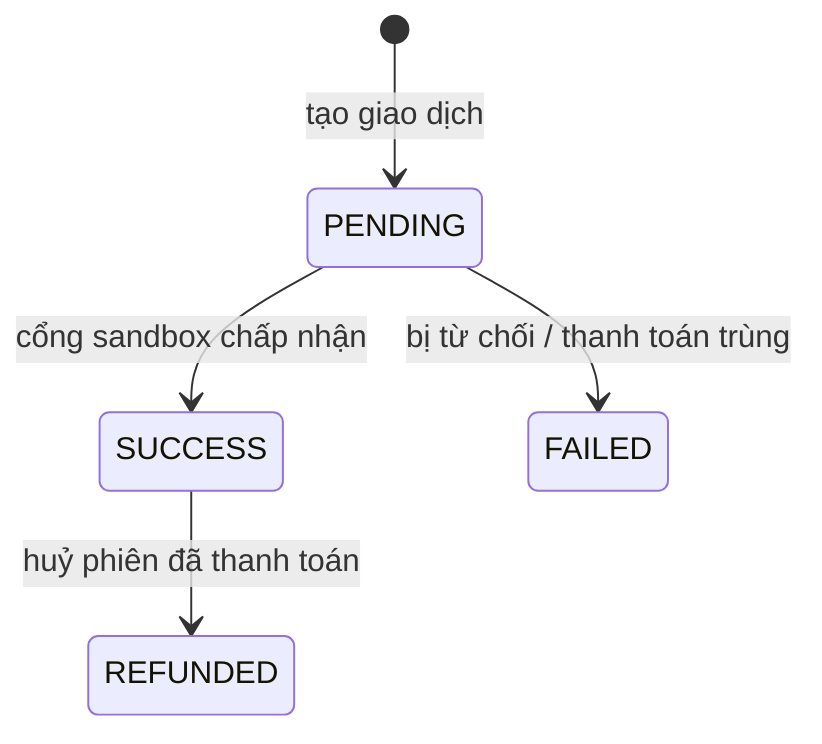
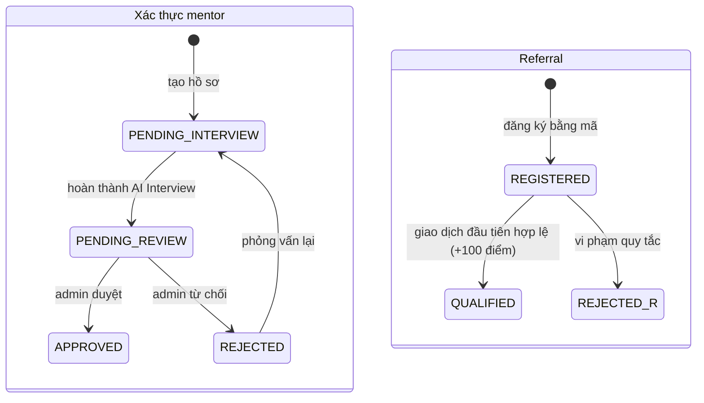

# Quy trình nghiệp vụ — MentorHub

Tài liệu mô tả nghiệp vụ theo 3 góc nhìn, dùng cho chương **Phân tích yêu cầu** và **Thiết kế** của báo cáo:
1. Biểu đồ use case theo tác nhân
2. Luồng nghiệp vụ dạng *màn hình → hành động → nhánh rẽ → kết quả* (theo định dạng SRD mục 8)
3. Sơ đồ tuần tự giữa các service và sơ đồ trạng thái của các thực thể chính

---

## 1. Tác nhân & use case

```mermaid
flowchart LR
    Mentee((Mentee))
    Mentor((Mentor))
    Admin((Admin))
    Timer((Bộ lập lịch<br/>hệ thống))

    subgraph Chung
      UC1[Đăng ký / đăng nhập / xác thực email]
      UC2[Quản lý tài khoản, đổi mật khẩu]
      UC3[Học trên Learning Hub, theo dõi tiến độ]
      UC4[Xem thông báo]
      UC5[Giới thiệu bạn bè, xem điểm thưởng]
    end
    subgraph Mentee_UC[Mentee]
      UC10[Tạo/sửa hồ sơ nghề nghiệp]
      UC11[Upload CV & trả lời chatbot enrichment]
      UC12[Xem mentor được AI đề xuất]
      UC13[Gửi / huỷ yêu cầu mentoring]
      UC14[Đặt lịch phiên]
      UC15[Thanh toán sandbox]
      UC16[Huỷ phiên]
      UC17[Đánh giá mentor]
    end
    subgraph Mentor_UC[Mentor]
      UC20[Tạo/sửa hồ sơ mentor, điền nhanh từ CV]
      UC21[Khai báo lịch rảnh]
      UC22[Làm AI Interview]
      UC23[Chấp nhận / từ chối yêu cầu]
      UC24[Đánh dấu phiên hoàn thành]
      UC25[Kết thúc quan hệ mentoring]
    end
    subgraph Admin_UC[Admin]
      UC30[Xem & khoá/mở khoá người dùng]
      UC31[Duyệt kết quả AI Interview]
      UC32[Quản lý khoá học, tài liệu, roadmap]
      UC33[Giám sát giao dịch & referral]
      UC34[Sinh lại embedding]
    end
    subgraph System_UC[Tự động]
      UC40[Nhắc lịch trước phiên]
      UC41[Huỷ phiên quá hạn thanh toán]
      UC42[Retry embedding / đối soát thanh toán]
    end

    Mentee --- UC1 & UC2 & UC3 & UC4 & UC5 & UC10 & UC11 & UC12 & UC13 & UC14 & UC15 & UC16 & UC17
    Mentor --- UC1 & UC2 & UC3 & UC4 & UC5 & UC16 & UC20 & UC21 & UC22 & UC23 & UC24 & UC25
    Admin --- UC1 & UC30 & UC31 & UC32 & UC33 & UC34
    Timer --- UC40 & UC41 & UC42
```



---

## 2. Luồng nghiệp vụ chi tiết

### 2.1 auth-service

**Đăng ký tài khoản** (FR-1.1)

Người dùng mở nền tảng → Trang chủ hiển thị giới thiệu cùng 2 nút *Đăng ký* và *Đăng nhập* → Người
dùng chọn *Đăng ký* (hoặc mở liên kết giới thiệu `/register?ref=MÃ`, ô mã giới thiệu được điền sẵn) →
Giao diện đăng ký hiển thị lựa chọn vai trò (Mentee/Mentor), họ tên, email, mật khẩu, mã giới thiệu →
Người dùng nhập thông tin và bấm *Đăng ký* → Hệ thống kiểm tra dữ liệu (email hợp lệ, mật khẩu ≥ 8 ký
tự) → **Nếu email đã tồn tại**: báo lỗi "Email đã được sử dụng", giữ nguyên form → **Nếu hợp lệ**: tạo
tài khoản (mật khẩu băm BCrypt), sinh liên kết xác thực email, nếu có mã giới thiệu thì ghi nhận
referral bên payment-service (mã sai không chặn đăng ký, chỉ hiển thị cảnh báo), cấp access token +
refresh token → Chuyển tới trang chủ theo vai trò kèm thông báo chào mừng và liên kết xác thực email.

**Đăng nhập** (FR-1.2)

Người dùng chọn *Đăng nhập* → Nhập email, mật khẩu → Hệ thống kiểm tra email có đang bị chặn tạm thời
→ **Nếu đã sai quá 5 lần**: báo "thử lại sau 15 phút" → Kiểm tra thông tin → **Nếu sai**: tăng bộ đếm,
báo "Email hoặc mật khẩu không đúng" → **Nếu tài khoản bị khoá**: báo "Tài khoản đã bị khoá" → **Nếu
đúng**: xoá bộ đếm, cấp token → Chuyển tới trang chủ mentee/mentor hoặc bảng điều khiển admin.

**Duy trì phiên đăng nhập**

Access token hết hạn (30 phút) → Request nhận 401 → Frontend tự gọi *refresh* với refresh token →
**Nếu hợp lệ**: token cũ bị thu hồi, cấp cặp mới, request được gửi lại tự động → **Nếu không hợp lệ**:
xoá phiên, chuyển về trang đăng nhập.

### 2.2 profile-service

**Tạo/chỉnh sửa hồ sơ mentor** (FR-2.4, FR-2.5)

Mentor đăng nhập → Trang chủ mentor hiển thị các bước: hoàn thành hồ sơ, khai báo lịch rảnh, vượt
qua AI Interview → Mentor chọn *Hồ sơ* → Giao diện hồ sơ hiển thị giá trị hiện có (tên hiển thị, lĩnh
vực, số năm kinh nghiệm, kỹ năng, giới thiệu, mức phí/giờ, sức chứa, portfolio, trạng thái nhận
mentee) và ô *Điền nhanh từ CV* → (Tuỳ chọn) Mentor tải CV PDF → hệ thống trích xuất kỹ năng và số năm
kinh nghiệm, điền vào form để mentor kiểm tra → Mentor chỉnh sửa và bấm *Lưu hồ sơ* → Hệ thống lưu hồ sơ,
chuẩn hoá thành đoạn văn bản, **nếu nội dung thay đổi** gửi sang matching-service sinh embedding mới và
lưu kèm hồ sơ → **Nếu matching-service lỗi**: vẫn lưu hồ sơ, đánh dấu embedding đang chờ, job nền tự
thử lại → Hiển thị thông báo thành công và trạng thái embedding; lần đầu tạo hồ sơ nhắc bước tiếp theo
là AI Interview.

**Khai báo lịch rảnh** (FR-2.4)

Trong trang hồ sơ, mentor thêm các khung *Thứ – giờ bắt đầu – giờ kết thúc* → Bấm *Lưu lịch rảnh* →
Hệ thống kiểm tra giờ kết thúc sau giờ bắt đầu và các khung trong cùng ngày không chồng lấn → **Nếu
sai**: báo lỗi → **Nếu đúng**: thay toàn bộ lịch rảnh cũ bằng lịch mới.

**Tạo/chỉnh sửa hồ sơ mentee** (FR-2.1 → FR-2.3)

Mentee chọn *Hồ sơ* → Nhập tên hiển thị, lĩnh vực muốn học, trình độ, kỹ năng hiện có, mục tiêu học
tập, portfolio → Bấm *Lưu* → Hệ thống lưu và sinh embedding như trên → Gợi ý bước tiếp theo: tải CV để
chatbot làm rõ mục tiêu hoặc tìm mentor ngay.

**Xem hồ sơ tóm tắt (nội bộ)**

Một service khác (mentoring-service khi hiển thị danh sách yêu cầu/phiên) yêu cầu tóm tắt hồ sơ của 1
người dùng → profile-service tìm trong hồ sơ mentor rồi mentee → **Nếu không có**: trả 404 (bên gọi
hiển thị "Người dùng") → **Nếu có**: trả tên hiển thị, vai trò, lĩnh vực — không kèm vector embedding.

### 2.3 matching-service

**Tìm mentor phù hợp** (FR-4.x, FR-5.1)

Mentee chọn *Tìm mentor* → Hệ thống lấy hồ sơ và embedding của mentee → **Nếu chưa có hồ sơ/embedding**:
thông báo "Bạn cần hoàn thành hồ sơ nghề nghiệp trước khi tìm mentor" kèm nút tạo hồ sơ → **Nếu đã
có**: lấy top-K mentor gần nhất theo cosine → loại mentor chưa được duyệt, tạm ngưng nhận mentee, chưa
có lịch rảnh, đã đủ sức chứa, khác lĩnh vực → tính điểm cuối kết hợp độ tương đồng, đánh giá, kinh
nghiệm → sinh lý do đề xuất → Giao diện hiển thị dòng tóm tắt pipeline (bao nhiêu mentor bị loại vì lý
do gì) và các thẻ mentor: tên, lĩnh vực, % phù hợp, kỹ năng (kỹ năng trùng được tô màu), lý do đề xuất,
mức phí → Mentee bấm *Xem hồ sơ* hoặc *Gửi yêu cầu mentoring* → **Nếu không có mentor phù hợp**: gợi ý
bổ sung kỹ năng/mục tiêu.

### 2.4 mentoring-service

**AI Interview** (FR-7.x)

Mentor đã lưu hồ sơ chọn *AI Interview* → Giao diện hướng dẫn trước khi bắt đầu → Mentor bấm *Bắt đầu
phỏng vấn* → **Nếu chưa có hồ sơ**: báo lỗi kèm liên kết tạo hồ sơ → **Nếu đang có buổi dở**: tiếp tục
buổi đó → **Nếu đang chờ duyệt / đã được duyệt**: báo trạng thái tương ứng → Hệ thống sinh câu hỏi đầu
tiên theo lĩnh vực và kỹ năng đã khai → Mentor nhập câu trả lời và bấm *Gửi* → Hệ thống chấm câu trả
lời, sinh câu tiếp theo: **nếu trả lời tốt** và chủ đề chưa đào sâu → hỏi sâu hơn cùng chủ đề; **ngược
lại** → chuyển chủ đề liên quan → Lặp lại đến lượt thứ 5 (trong lúc làm, mentor không thấy điểm) → Sau
lượt cuối hệ thống tổng hợp điểm 0–100, tóm tắt, điểm mạnh/yếu, khuyến nghị → Hiển thị kết quả cho
mentor kèm thông báo "đang chờ quản trị viên xem xét" → Gửi thông báo cho admin.

**Admin duyệt mentor** (FR-7.5)

Admin mở *Duyệt mentor* → Danh sách buổi phỏng vấn chờ duyệt (điểm AI, khuyến nghị) → Admin mở một
buổi → Xem toàn bộ hội thoại, điểm và nhận xét từng câu, đánh giá tổng hợp → Nhập nhận xét, bấm *Duyệt
& kích hoạt* hoặc *Từ chối* → **Duyệt**: hồ sơ mentor chuyển APPROVED, mentor xuất hiện trong kết quả
matching và nhận được yêu cầu → **Từ chối**: hồ sơ chuyển REJECTED, mentor được phép cập nhật hồ sơ và
phỏng vấn lại → Mentor nhận thông báo kết quả.

**Upload CV và chatbot enrichment** (FR-8.x)

Mentee đã có hồ sơ chọn *Tải CV & làm rõ mục tiêu* → Chọn file PDF → Hệ thống kiểm tra file (PDF, ≤
5MB, ≤ 10 trang, có lớp văn bản) → **Nếu không hợp lệ**: báo lỗi cụ thể → **Nếu chưa có hồ sơ**: báo
cần tạo hồ sơ trước → Phân tích CV thành vai trò, kỹ năng, số năm kinh nghiệm, dự án, học vấn → Hiển thị
thẻ "Thông tin trích xuất từ CV" và khung chat với câu hỏi đầu tiên nhắc lại thông tin trong CV →
Mentee trả lời → Hệ thống chọn câu hỏi tiếp theo về thông tin CV chưa có, bỏ qua điều đã được trả lời →
Lặp đến lượt 4 → Tổng hợp đoạn mục tiêu chuẩn hoá → Gửi sang profile-service cập nhật mục tiêu, bổ sung
kỹ năng từ CV và sinh lại embedding → Hiển thị mục tiêu đã làm rõ và nút *Tìm mentor phù hợp*.

**Gửi yêu cầu mentoring & phản hồi** (FR-5.2, FR-5.3)

Mentee bấm *Gửi yêu cầu mentoring* ở thẻ/hồ sơ mentor → Nhập lời nhắn → Hệ thống kiểm tra mentor đã
được duyệt, đang nhận mentee, chưa có yêu cầu đang chờ/đang hoạt động giữa hai bên → Tạo yêu cầu, thông
báo mentor → Mentor mở *Yêu cầu* → Bấm *Chấp nhận* hoặc *Từ chối* (kèm lý do) → **Chấp nhận khi đã đủ
sức chứa**: báo lỗi "đã nhận đủ số mentee tối đa" → **Chấp nhận hợp lệ**: cập nhật số mentee đang hướng
dẫn sang profile-service → Mentee nhận thông báo; nếu được chấp nhận, nút *Đặt lịch* xuất hiện.

**Đặt lịch phiên mentoring** (FR-5.4)

Mentee đã được chấp nhận mở hồ sơ mentor → Giao diện hiển thị lịch rảnh hằng tuần của mentor và form
đặt lịch (thời lượng, chủ đề, chi phí tạm tính) kèm **bộ chọn khung giờ**: hệ thống liệt kê các giờ bắt đầu
còn đặt được trong 14 ngày tới (bước 30 phút, nằm trọn trong lịch rảnh, đã trừ phiên đang giữ chỗ của mentor
và của mentee) → Mentee chọn ngày, giờ rồi bấm *Xác nhận* → Hệ thống
kiểm tra: đặt trước ít nhất 1 giờ và trong vòng 60 ngày; phiên nằm trọn trong một khung rảnh của mentor
(theo giờ Việt Nam); không trùng phiên đang giữ chỗ của mentor hoặc của chính mentee → **Nếu vi phạm**:
báo lỗi, giữ nguyên form và tải lại danh sách giờ trống (khung giờ có thể vừa bị người khác đặt) → **Nếu hợp lệ**: tạo phiên, giá = mức phí/giờ × thời lượng → **Phiên miễn
phí**: xác nhận ngay → **Phiên có phí**: trạng thái *chờ thanh toán*, chuyển tới trang thanh toán.

**Nhắc lịch** (FR-5.5)

Mỗi phút, hệ thống tìm các phiên đã xác nhận sẽ bắt đầu trong 24 giờ tới và chưa được nhắc → Gửi thông
báo cho mentor và mentee → Đánh dấu đã nhắc.

**Hoàn thành & đánh giá** (FR-5.6, FR-5.7)

Sau buổi học, mentor bấm *Đánh dấu hoàn thành* (hoặc hệ thống tự hoàn thành sau khi phiên kết thúc 2
giờ) → Mentee nhận thông báo mời đánh giá → Mentee mở *Phiên học*, bấm *Đánh giá*, chọn số sao và nhận
xét → Hệ thống kiểm tra phiên đã hoàn thành và chưa được đánh giá → Lưu đánh giá, tính lại điểm trung
bình của mentor, đồng bộ sang profile-service (ảnh hưởng xếp hạng matching) → Mentor nhận thông báo.

**Huỷ phiên**

Người tham gia bấm *Huỷ* với phiên chưa bắt đầu → **Phiên đã thanh toán**: yêu cầu payment-service hoàn
tiền trước; nếu hoàn tiền lỗi thì báo lỗi và không huỷ → Chuyển phiên sang *Đã huỷ* → Thông báo cho bên
còn lại.

### 2.5 learning-service

**Học khoá học & theo dõi tiến độ** (FR-3.1 → FR-3.3)

Người dùng chọn *Learning Hub* → Tab *Khoá học của tôi* hiển thị các khoá đã đăng ký kèm thanh tiến độ;
tab *Tất cả khoá học* lọc theo lĩnh vực/từ khoá; tab *Roadmap* hiển thị các lộ trình → Người dùng mở một
khoá → Giao diện chi tiết: mô tả, % hoàn thành, danh sách tài liệu (bài viết, video, tài liệu, bài tập)
→ Bấm *Đăng ký học* → Mở tài liệu, tích ô hoàn thành → Hệ thống ghi nhận và tính lại % = số tài liệu đã
hoàn thành / tổng số tài liệu → Với roadmap, người dùng tích từng bước; bước có liên kết khoá học dẫn
sang khoá tương ứng.

**Quản lý nội dung** (FR-3.4)

Admin mở *Nội dung* → Tạo khoá học (tiêu đề, mô tả, lĩnh vực, cấp độ, kỹ năng) → Chọn khoá để thêm/xoá
tài liệu → Tạo roadmap và thêm bước (có thể liên kết khoá học) → Xoá khoá/roadmap kèm xác nhận.

### 2.6 payment-service

**Thanh toán phiên đã đặt** (FR-6.1 → FR-6.3)

Mentee ở trang thanh toán → Giao diện hiển thị thông tin phiên, số tiền, lịch sử giao dịch của phiên và
form thẻ (có sẵn danh sách thẻ test) → Mentee bấm *Thanh toán* → Hệ thống lấy giá phiên từ
mentoring-service, kiểm tra người thanh toán là mentee của phiên, phiên đang chờ thanh toán, chưa có giao
dịch thành công → Tạo giao dịch *PENDING* → Gửi tới cổng sandbox → **Thất bại** (thẻ bị từ chối, không
đủ số dư, hết hạn…): cập nhật *FAILED* kèm lý do, phiên vẫn chờ thanh toán, mentee có thể thử lại →
**Thành công**: cập nhật *SUCCESS*, xử lý thưởng giới thiệu, báo mentoring-service xác nhận phiên →
Hiển thị "Thanh toán thành công" → Chuyển về danh sách phiên, phiên hiển thị *Đã xác nhận*.

**Giới thiệu bạn bè** (FR-6.4 → FR-6.6)

Người dùng mở *Giới thiệu* → Hệ thống tạo (lần đầu) mã 8 ký tự và liên kết chia sẻ, hiển thị số người
đã giới thiệu, số lượt hợp lệ, điểm, quy tắc → Bạn bè đăng ký bằng liên kết → referral ở trạng thái *Đã
đăng ký* → Khi bạn bè có giao dịch thành công **đầu tiên** từ 50.000đ → **Nếu người giới thiệu chính là
mentor của giao dịch** hoặc **đã đạt giới hạn 5 lượt thưởng trong ngày**: referral bị *từ chối* kèm lý
do → **Ngược lại**: referral *hợp lệ*, người giới thiệu được cộng 100 điểm vào sổ điểm.

---

## 3. Sơ đồ tuần tự các luồng liên service

### 3.1 Đặt lịch → thanh toán → xác nhận

```mermaid
sequenceDiagram
    autonumber
    actor Me as Mentee
    participant FE as frontend
    participant MS as mentoring-service
    participant PS as profile-service
    participant PAY as payment-service
    participant GW as SandboxGateway

    Me->>FE: Chọn giờ, thời lượng → Xác nhận
    FE->>MS: POST /api/mentoring/sessions
    MS->>MS: kiểm tra lead time, yêu cầu ACCEPTED
    MS->>PS: GET /internal/mentor/{id} (lịch rảnh, mức phí)
    MS->>MS: BookingRules.fitsAvailability
    MS->>MS: BEGIN; pg_advisory_xact_lock(mentor);<br/>kiểm tra trùng lịch; INSERT session PENDING; COMMIT
    MS-->>FE: 201 Session(PENDING, price)
    FE->>Me: Trang thanh toán
    Me->>FE: Nhập thẻ → Thanh toán
    FE->>PAY: POST /api/payment/charge
    PAY->>MS: GET /internal/sessions/{id}
    MS-->>PAY: menteeId, mentorId, price, status
    PAY->>PAY: INSERT transaction PENDING
    PAY->>GW: charge(card, amount)
    alt Thẻ hợp lệ
        GW-->>PAY: success, providerReference
        PAY->>PAY: UPDATE SUCCESS; xử lý referral (cùng transaction)
        PAY->>MS: POST /internal/sessions/{id}/payment-succeeded
        MS->>MS: session → CONFIRMED; thông báo 2 bên
        PAY-->>FE: Transaction SUCCESS
    else Bị từ chối
        GW-->>PAY: failure CARD_DECLINED
        PAY->>PAY: UPDATE FAILED
        PAY-->>FE: Transaction FAILED (phiên vẫn PENDING)
    end
    Note over PAY,MS: Nếu bước báo xác nhận lỗi: session_synced=false,<br/>PaymentReconciliationJob gửi lại mỗi phút
```

### 3.2 AI Interview → admin duyệt → xuất hiện trong matching



### 3.3 Đăng ký có mã giới thiệu → cộng điểm



---

## 4. Sơ đồ trạng thái

### 4.1 Yêu cầu mentoring



### 4.2 Phiên mentoring



### 4.3 Giao dịch



### 4.4 Trạng thái xác thực mentor & referral


