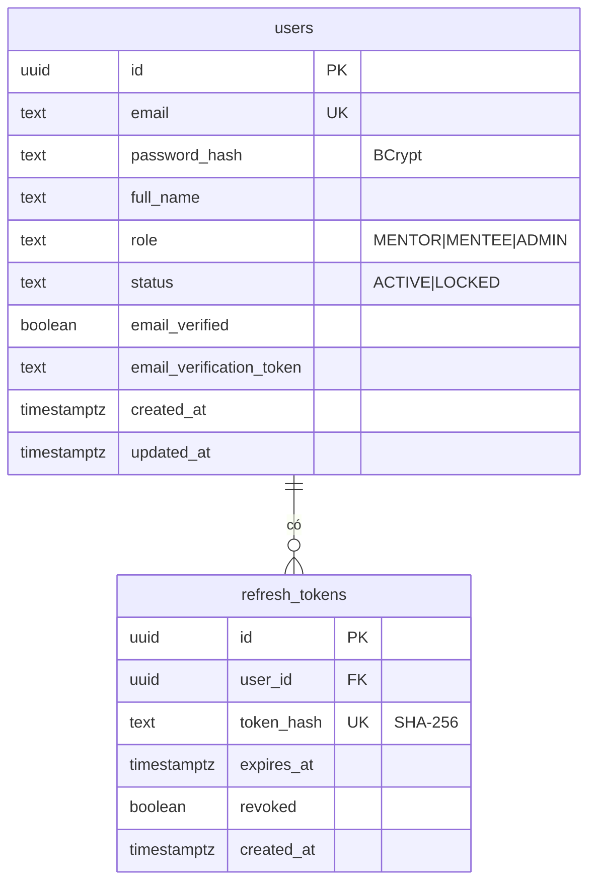
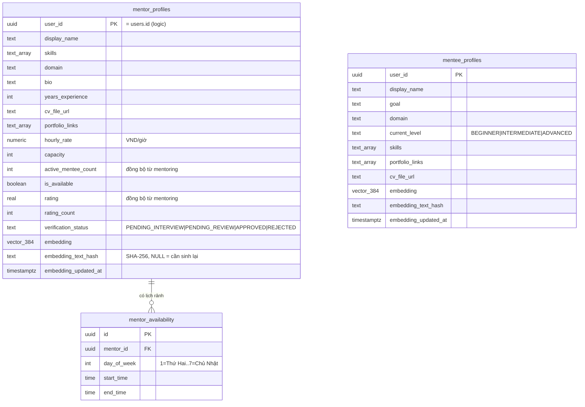
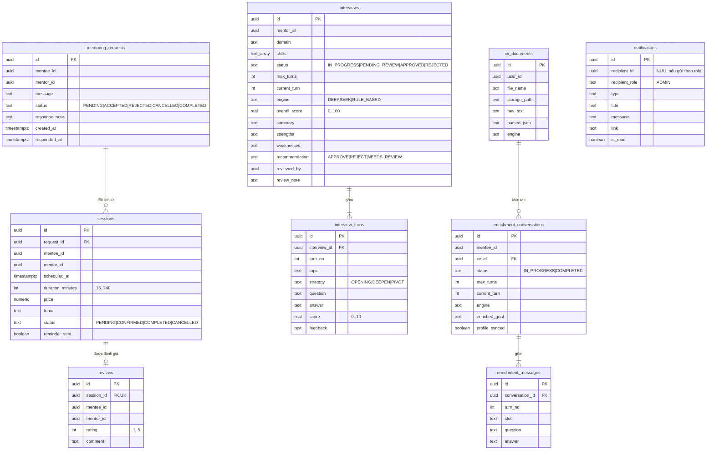
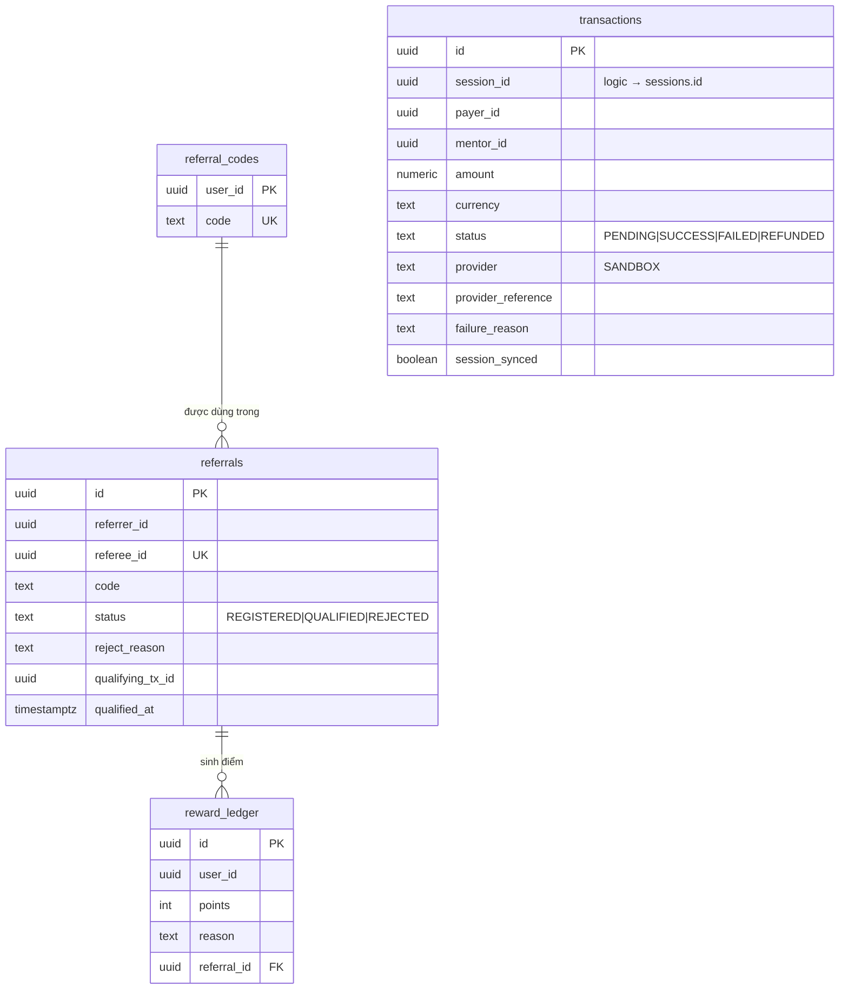
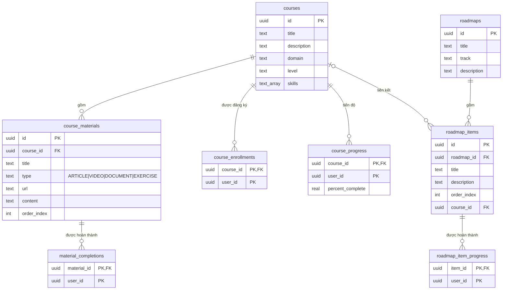

# Thiết kế cơ sở dữ liệu — MentorHub

Nguyên tắc **database-per-service**: mỗi service sở hữu một CSDL PostgreSQL 16 riêng; không service
nào ghi vào CSDL của service khác. Liên kết giữa các service chỉ là **khoá tham chiếu logic** (UUID
người dùng/phiên) — không có khoá ngoại vật lý xuyên CSDL. Schema nằm tại `db/init/<service>.sql`
và được chạy tự động khi container CSDL khởi tạo lần đầu.

| CSDL | Service sở hữu | Cổng host | Ghi chú |
|---|---|---|---|
| `auth_db` | auth-service | 5433 | |
| `profile_db` | profile-service | 5434 | Image `pgvector/pgvector:pg16`; matching-service đọc read-only qua role `matching_reader` |
| `mentoring_db` | mentoring-service | 5435 | |
| `payment_db` | payment-service | 5436 | |
| `learning_db` | learning-service | 5437 | Có dữ liệu seed khoá học/roadmap |

Quy ước: tên bảng/cột `snake_case`; khoá chính `UUID DEFAULT gen_random_uuid()`; thời gian
`TIMESTAMPTZ`; trạng thái là `TEXT` + ràng buộc `CHECK` (ánh xạ `enum` trong Java).

---

## 1. auth_db

| Bảng | Mô tả |
|---|---|
| `users` | Tài khoản. Tài khoản ADMIN được tạo tự động khi khởi động (`AdminSeeder`), không đăng ký qua API |
| `refresh_tokens` | Refresh token dạng băm; `revoked = true` khi đã dùng để refresh, đăng xuất, đổi mật khẩu hoặc bị khoá |

Ngoài CSDL: Redis key `auth:login-fail:<email>` (đếm số lần đăng nhập sai, TTL 15 phút).

---

## 2. profile_db

| Đối tượng | Mô tả |
|---|---|
| `mentor_profiles` | Hồ sơ mentor + dữ liệu phục vụ matching (vector, trạng thái xác thực, sức chứa, rating) |
| `mentee_profiles` | Hồ sơ mentee + vector |
| `mentor_availability` | Khung giờ rảnh lặp lại hằng tuần (giờ Việt Nam); `CHECK (end_time > start_time)` |
| `idx_mentor_profiles_embedding`, `idx_mentee_profiles_embedding` | Chỉ mục **HNSW** với `vector_cosine_ops` phục vụ truy vấn láng giềng gần nhất theo cosine |
| Role `matching_reader` | Chỉ có `SELECT` trên 3 bảng trên — hiện thực hoá ngoại lệ kiến trúc read-only |

Ý nghĩa `embedding_text_hash` (NFR-7): lưu SHA-256 của đoạn văn bản chuẩn hoá đã dùng để sinh vector.
Khi lưu hồ sơ, nếu hash không đổi thì bỏ qua bước gọi model; nếu gọi model lỗi thì đặt `NULL` để job
retry nhận ra (vector cũ vẫn giữ để matching tiếp tục hoạt động).

---

## 3. mentoring_db

| Bảng | Mô tả |
|---|---|
| `mentoring_requests` | Yêu cầu mentoring; số yêu cầu `ACCEPTED` phân biệt theo mentee = số mentee đang được hướng dẫn (so với `capacity`) |
| `sessions` | Phiên mentoring. `PENDING` = chờ thanh toán. Chỉ mục `(mentor_id, scheduled_at)` phục vụ kiểm tra trùng lịch |
| `reviews` | Đánh giá 1–1 với phiên (`session_id` UNIQUE) |
| `notifications` | Thông báo trong ứng dụng, gửi cho 1 người hoặc cho cả role ADMIN |
| `interviews` | Buổi AI Interview + kết quả tổng hợp + quyết định admin. Phần tính toán AI ở ai-service (không có CSDL); `engine` ghi engine đã dùng để các lượt sau nhất quán |
| `interview_turns` | Từng lượt hỏi-đáp; `UNIQUE (interview_id, turn_no)` chống ghi trùng |
| `cv_documents` | CV đã upload: văn bản trích xuất + kết quả parse (JSON); file PDF nằm trên volume `cv-storage` |
| `enrichment_conversations` / `enrichment_messages` | Hội thoại chatbot làm rõ mục tiêu và từng lượt hỏi-đáp theo slot |

---

## 4. payment_db

| Đối tượng | Mô tả |
|---|---|
| `transactions` | Giao dịch thanh toán; `uq_transactions_session_success` — unique partial index đảm bảo mỗi phiên tối đa 1 giao dịch `SUCCESS` |
| `referral_codes` | Mỗi người dùng 1 mã (tạo lần đầu khi xem trang giới thiệu) |
| `referrals` | Quan hệ người giới thiệu → người được giới thiệu; `CHECK (referrer_id <> referee_id)`, `referee_id` UNIQUE |
| `reward_ledger` | Sổ cái điểm thưởng dạng append-only; số dư = `SUM(points)` |

---

## 5. learning_db

`course_progress.percent_complete` = số tài liệu đã hoàn thành / tổng số tài liệu × 100 (làm tròn 1
chữ số thập phân), được tính lại mỗi khi người dùng đánh dấu/bỏ đánh dấu một tài liệu. Dữ liệu seed:
5 khoá học, 15 tài liệu, 3 roadmap (Backend, DevOps, Frontend).

---

## 6. Ánh xạ tham chiếu giữa các CSDL

| Giá trị | Nguồn gốc | Được tham chiếu ở |
|---|---|---|
| `users.id` | auth_db | `mentor_profiles.user_id`, `mentee_profiles.user_id`, `mentoring_requests.mentee_id/mentor_id`, `sessions.*_id`, `interviews.mentor_id`, `cv_documents.user_id`, `transactions.payer_id/mentor_id`, `referral_codes.user_id`, `referrals.*_id`, `course_enrollments.user_id`… |
| `sessions.id` | mentoring_db | `transactions.session_id` |
| `cv_documents.id` | mentoring_db | `mentee_profiles.cv_file_url` (dạng `/api/mentoring/cv/{id}/file`) |
