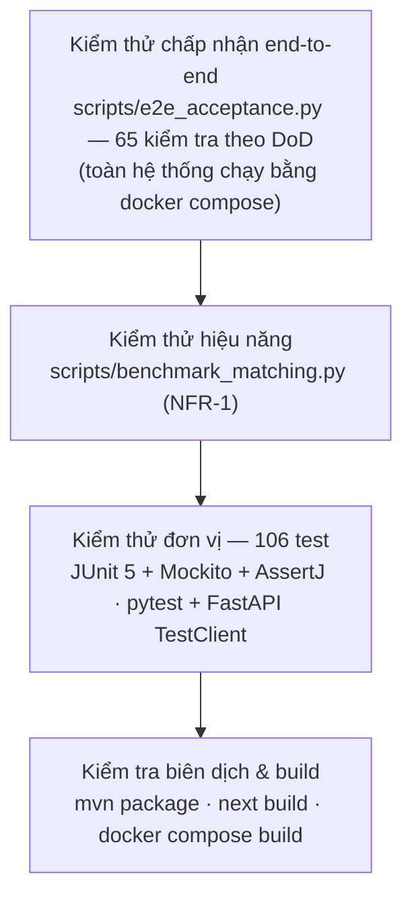

# Báo cáo kiểm thử — MentorHub

Tài liệu dùng cho chương **Kiểm thử & đánh giá** của báo cáo. Số liệu trong tài liệu là kết quả chạy
thực tế ngày 17/09/2026 (sau khi tách ai-service và chuyển sang DeepSeek) trên máy phát triển (macOS, Docker Desktop, JDK 21, Python 3.12, Node 26).

## 1. Chiến lược kiểm thử



| Cấp độ | Mục tiêu | Công cụ | Chạy ở |
|---|---|---|---|
| Đơn vị | Logic nghiệp vụ thuần & thuật toán AI: chấm điểm phỏng vấn, parse CV, chatbot slot, quy tắc đặt lịch, job nền, referral chống gian lận, cổng thanh toán, pipeline matching, bảo mật token | JUnit 5, Mockito, AssertJ, pytest | Máy dev, CI |
| API / tích hợp service | Hợp đồng HTTP của matching-service và ai-service; client DeepSeek với API giả lập (`httpx.MockTransport`); `AiClient` của mentoring-service với server HTTP giả lập ai-service | FastAPI `TestClient`, JDK `HttpServer` | Máy dev, CI |
| End-to-end | Toàn bộ Definition of Done qua REST API thật, CSDL thật, model embedding thật | Python (`urllib`), docker compose | Máy dev, CI (job `e2e`) |
| Hiệu năng | NFR-1 với ~5.000 hồ sơ mentor | `benchmark_matching.py` | Máy dev |
| Smoke giao diện | Mọi route frontend trả 200; các luồng chính gọi được qua proxy; đăng nhập thật qua form và chụp màn hình 3 vai trò (1280px, 390px), không có lỗi console, không tràn ngang trên điện thoại | curl, Chrome headless (puppeteer-core) | Máy dev |

Nguyên tắc thiết kế để dễ kiểm thử: engine AI rule-based **tất định**; các quy tắc nghiệp vụ tách thành
hàm thuần (`BookingRules`, `ReferralService.onSuccessfulTransaction`, `hard_filter`, `re_rank`,
`explain`); engine DeepSeek có fallback và được giả lập nên kiểm thử không cần API key.

## 2. Kiểm thử đơn vị

### 2.1 Tổng hợp

| Service | File test | Số test | Kết quả |
|---|---|---|---|
| auth-service | `AuthServiceTest` | 9 | ✅ 9/9 |
| profile-service | `ProfileLogicTest` | 6 | ✅ 6/6 |
| learning-service | `LearningServiceTest` | 2 | ✅ 2/2 |
| payment-service | `ReferralServiceTest` (9), `SandboxPaymentGatewayTest` (4) | 13 | ✅ 13/13 |
| mentoring-service | `BookingRulesTest` (8), `AiClientTest` (5), `SessionSchedulerTest` (3) | 16 | ✅ 16/16 |
| matching-service | `test_pipeline.py` (10), `test_api.py` (9) | 19 | ✅ 19/19 |
| ai-service | `test_interview_rule_based.py` (10), `test_cv.py` (9), `test_enrichment_rule_based.py` (6), `test_deepseek.py` (8), `test_api.py` (8) | 41 | ✅ 41/41 |
| **Tổng** | | **106** | **✅ 106/106** |

Lệnh chạy:

```bash
(cd auth-service && mvn test)        # tương tự cho profile/learning/payment/mentoring-service
(cd matching-service && pip install -r requirements-dev.txt && python -m pytest -q tests)
(cd ai-service && pip install -r requirements-dev.txt && python -m pytest -q tests)
```

### 2.2 Danh mục test case

**auth-service — `AuthServiceTest`**

| # | Test case | Kỳ vọng |
|---|---|---|
| 1 | Đăng ký: băm mật khẩu, cấp access token hợp lệ | Mật khẩu lưu dạng BCrypt; JWT giải mã được đúng userId/role |
| 2 | Access token ký bằng HS256 | Header JWT `alg = HS256` (tương thích PyJWT của matching-service) |
| 3 | Đăng ký kèm mã giới thiệu | Gọi payment-service với mã đã chuẩn hoá (trim, viết hoa) |
| 4 | Email trùng | `EMAIL_ALREADY_EXISTS` |
| 5 | Sai mật khẩu 3 lần (ngưỡng test) | Lần sau bị `TOO_MANY_ATTEMPTS` dù mật khẩu đúng; bộ đếm chạy được khi Redis lỗi |
| 6 | Tài khoản bị khoá đăng nhập | `ACCOUNT_LOCKED` |
| 7 | Refresh token xoay vòng & phát hiện dùng lại | Token cũ bị thu hồi; dùng lại → lỗi + thu hồi toàn bộ phiên |
| 8 | `verify-token` | Hợp lệ với user ACTIVE; không hợp lệ khi bị khoá hoặc chuỗi rác |
| 9 | Đổi mật khẩu | Sai mật khẩu hiện tại → `WRONG_PASSWORD`; thành công → thu hồi mọi refresh token |

**profile-service — `ProfileLogicTest`**

| # | Test case | Kỳ vọng |
|---|---|---|
| 1 | Chuẩn hoá văn bản mentor/mentee | Cùng cấu trúc `Domain. Skills. ...`, gộp khoảng trắng |
| 2 | Chuẩn hoá danh sách kỹ năng | Bỏ rỗng, bỏ trùng không phân biệt hoa thường, giữ thứ tự |
| 3 | Chuỗi vector pgvector | `[0.5,-1.0,0.25]` |
| 4 | NFR-7: văn bản không đổi | Không gọi matching-service, trả `UNCHANGED` |
| 5 | matching-service lỗi | Trả `PENDING`, đặt `embedding_text_hash = NULL` để retry |
| 6 | Sinh embedding thành công | Ghi vector + hash SHA-256 |

**learning-service — `LearningServiceTest`**: công thức % hoàn thành (1/3 → 33,3; 2/3 → 66,7; khoá không
có tài liệu → 0; hoàn thành nhiều hơn tổng do tài liệu bị xoá → 100).

**payment-service**

| # | Test case | Kỳ vọng |
|---|---|---|
| 1 | Mã giới thiệu ngẫu nhiên | 8 ký tự, không chứa ký tự dễ nhầm (O, 0, I, 1) |
| 2 | Tạo mã lần đầu | Lưu 1 bản ghi |
| 3 | Tự giới thiệu / được giới thiệu lần 2 | `SELF_REFERRAL` / `ALREADY_REFERRED` |
| 4 | Mã không tồn tại | `REFERRAL_CODE_NOT_FOUND` |
| 5 | Giao dịch đầu tiên ≥ 50.000đ | Referral `QUALIFIED`, +100 điểm cho người giới thiệu |
| 6 | Giao dịch nhỏ hơn ngưỡng | Vẫn `REGISTERED`, không cộng điểm |
| 7 | Không phải giao dịch đầu tiên | Không cộng điểm |
| 8 | Người giới thiệu là mentor của giao dịch | `REJECTED` — `REFERRER_IS_SESSION_MENTOR` |
| 9 | Vượt giới hạn/ngày | `REJECTED` — `DAILY_LIMIT_EXCEEDED` |
| 10 | Thẻ 4242… | SUCCESS, có mã tham chiếu `sbx_ch_…` |
| 11 | Thẻ …0002 / …9995 | `CARD_DECLINED` / `INSUFFICIENT_FUNDS` |
| 12 | Số thẻ sai Luhn, thẻ hết hạn, CVV sai | `INVALID_CARD_NUMBER`, `CARD_EXPIRED`, `INVALID_CVV` |
| 13 | Thuật toán Luhn | Đúng với số mẫu chuẩn |

**mentoring-service**

| Nhóm | Test case chính |
|---|---|
| Đặt lịch — `BookingRulesTest` (8) | Phiên nằm trong khung rảnh; tràn khung/bắt đầu sớm/sai ngày bị từ chối; tính theo múi giờ Việt Nam (12:00 UTC = 19:00 GMT+7); phát hiện chồng lấn (nối tiếp không tính chồng); phiên đã huỷ không chặn lịch; công thức giá và làm tròn 1.000đ; liệt kê khung giờ trống theo bước 30 phút vừa khít thời lượng, bỏ giờ trước mốc sớm nhất và giờ chồng lấn phiên đang giữ chỗ (phiên đã huỷ không chặn) |
| Gọi ai-service — `AiClientTest` (5) | Gửi lịch sử + engine đã dùng + internal token đúng hợp đồng; lượt đầu không gửi engine; upload CV dạng multipart; lỗi 4xx của ai-service (ví dụ `CV_NO_TEXT`) được chuyển tiếp nguyên mã và HTTP status; lỗi 5xx / không kết nối được → 502 `AI_SERVICE_UNAVAILABLE` |
| Job nền — `SessionSchedulerTest` (3) | Nhắc lịch truy vấn đúng cửa sổ 24 giờ, gửi cho cả mentor và mentee, hiển thị giờ Việt Nam, đánh dấu đã nhắc; huỷ phiên chưa thanh toán quá 30 phút; chỉ tự hoàn thành phiên CONFIRMED đã kết thúc quá 2 giờ |

**ai-service**

| File | Test case chính |
|---|---|
| `test_interview_rule_based.py` (10) | Câu mở đầu ưu tiên chủ đề khớp kỹ năng mentor; câu trả lời tốt → điểm ≥ 8 và DEEPEN cùng chủ đề; câu trả lời yếu → điểm < 3 và PIVOT; mỗi chủ đề chỉ đào sâu 1 lần; lượt cuối không sinh câu hỏi; buổi 5 lượt trả lời yếu đi qua 5 chủ đề khác nhau; ngưỡng khuyến nghị APPROVE/REJECT/NEEDS_REVIEW và điểm mạnh/yếu; lĩnh vực lạ ("blockchain") → bộ câu hỏi chung; ánh xạ "Frontend Web", "AI/ML"; làm tròn điểm kiểu half-up |
| `test_cv.py` (9) | CV mẫu tiếng Việt: kỹ năng, vai trò, số năm (03/2022–03/2024 = 2), 2 dự án + công nghệ, học vấn; "8+ years of experience" ưu tiên hơn khoảng thời gian; khoảng "– nay" tính tới hiện tại; năm học không tính kinh nghiệm; kỹ năng xuất hiện nhiều xếp trước; khớp nguyên từ (Google ≠ Go, JavaScript ≠ Java, React Native ≠ React); đọc PDF bằng pypdf; từ chối file không phải PDF; từ chối PDF không có lớp văn bản |
| `test_enrichment_rule_based.py` (6) | Câu đầu tham chiếu kỹ năng & số năm từ CV; chỉ hỏi dự án khi CV không có; bỏ TIMELINE khi đã nêu mốc thời gian; nhận diện "6 thang" (không dấu); không bao giờ lặp slot; goal tổng hợp đủ các phần + nền tảng CV |
| `test_deepseek.py` (8) | Không có key → tắt; request đúng định dạng OpenAI-compatible (`/chat/completions`, Bearer, `response_format: json_object`, prompt chứa chữ "json" + ví dụ); nội dung rỗng → thử lại 1 lần; 503 → thử lại, 401 → không thử lại; JSON sai / bị cắt (`finish_reason=length`) → rỗng; bỏ code fence markdown; engine phỏng vấn dùng kết quả model và kẹp điểm 0–10; thiếu câu hỏi tiếp theo → fallback rule-based; parser CV làm sạch đầu ra model |
| `test_api.py` (8) | Health báo `llmEnabled=false` khi không có key; thiếu internal token → 403; vòng phỏng vấn đầy đủ qua API với JSON camelCase; yêu cầu DEEPSEEK khi không có key → RULE_BASED; upload CV multipart; lỗi file dùng format lỗi chung; endpoint enrichment; lỗi validate → 400 `VALIDATION_ERROR` |

**matching-service**

| File | Test case chính |
|---|---|
| `test_pipeline.py` (10) | Hard filter loại đúng 5 loại vi phạm và đếm lý do; so khớp lĩnh vực không phân biệt hoa thường/khoảng trắng; mentor chưa APPROVED (mọi trạng thái) luôn bị loại; re-rank sắp xếp giảm dần; kiểm tra số học công thức (0,82); cold-start dùng rating trung tính; kẹp similarity về [0,1]; độ tương đồng thắng rating cao; sinh lý do (trùng kỹ năng, khớp mục tiêu, cùng lĩnh vực, tương đồng, rating, kinh nghiệm); khớp mục tiêu theo nguyên từ |
| `test_api.py` (9) | Health; thiếu token → 401 đúng format lỗi; token giả mạo/refresh token → 401; mentee xem gợi ý của người khác → 403; response đúng contract camelCase + thống kê pipeline; hồ sơ chưa đủ → 404 `MENTEE_PROFILE_INCOMPLETE`; admin xem được mọi mentee; `/internal/embed` bắt buộc internal token; text rỗng → 400 `VALIDATION_ERROR` |

## 3. Kiểm thử chấp nhận end-to-end

Script `scripts/e2e_acceptance.py` tạo người dùng mới mỗi lần chạy (email ngẫu nhiên) và đi qua toàn bộ
nghiệp vụ trên hệ thống thật (`docker compose up` + `seed_demo.py`).

**Kết quả lần chạy cuối: 65/65 PASS, thời gian ~2,9 giây** (ai-service chạy engine rule-based).

| DoD | Kiểm tra | Kết quả |
|---|---|---|
| 1 | Đăng ký mentee & mentor trả JWT | ✅ |
| 1 | Đăng nhập mentee | ✅ |
| 1 | Đăng nhập admin (tài khoản seed) | ✅ |
| 1 | Email trùng bị từ chối (409) | ✅ |
| 1 | RBAC: mentee không gọi được API admin (403) | ✅ |
| 1 | Endpoint `/internal` chặn JWT người dùng (403) | ✅ |
| 1 | Refresh token xoay vòng, token cũ không dùng lại được | ✅ |
| 2 | Mentee tạo hồ sơ, embedding sinh ngay khi lưu | ✅ |
| 2 | NFR-7: lưu lại hồ sơ không đổi thì không sinh lại embedding | ✅ |
| 2 | Không sửa được hồ sơ người khác (403) | ✅ |
| 3 | Parse CV: trích xuất kỹ năng | ✅ |
| 3 | Parse CV: trích xuất dự án & kinh nghiệm | ✅ |
| 3 | Câu hỏi đầu dựa trên CV (nhắc lại kỹ năng đã có) | ✅ |
| 3 | Hội thoại kết thúc sau đúng 4 lượt, không lặp slot | ✅ |
| 3 | Mốc thời gian đã nêu ("6 tháng") nên không hỏi lại TIMELINE | ✅ |
| 3 | Tổng hợp goal chuẩn hoá | ✅ |
| 3 | Goal được ghi vào profile-service + gộp kỹ năng từ CV | ✅ |
| 3 | Embedding được sinh lại sau enrichment | ✅ |
| 4 | Lịch rảnh chồng lấn bị từ chối | ✅ |
| 5 | Mentor chưa qua AI Interview không xuất hiện trong matching | ✅ |
| 5 | Không gửi được yêu cầu tới mentor chưa xác thực | ✅ |
| 4 | Điểm từng câu bị ẩn với mentor khi đang phỏng vấn | ✅ |
| 4 | AI Interview dừng sau đúng 5 lượt (FR-7.3) | ✅ |
| 4 | Engine AI được ghi nhận (ai-service: DEEPSEEK hoặc RULE_BASED) | ✅ |
| 4 | Câu hỏi thích ứng: có cả DEEPEN và PIVOT (FR-7.2) | ✅ |
| 4 | Tổng hợp điểm + nhận xét, chờ admin duyệt (FR-7.4) | ✅ |
| 4 | Trạng thái xác thực mentor = PENDING_REVIEW | ✅ |
| 5 | Mentor chờ duyệt vẫn chưa xuất hiện trong matching (NFR-8) | ✅ |
| 4 | Admin thấy buổi phỏng vấn trong danh sách chờ duyệt | ✅ |
| 4 | Admin duyệt → mentor được kích hoạt (APPROVED) | ✅ |
| 6 | Mentor vừa được duyệt xuất hiện trong matching | ✅ |
| 6 | Có similarityScore, finalScore và lý do đề xuất | ✅ |
| 6 | Kết quả sắp xếp giảm dần theo finalScore | ✅ |
| 7 | Không mentor nào khác lĩnh vực / hết chỗ / chưa duyệt trong kết quả | ✅ |
| 7 | Thống kê pipeline cho thấy mentor chưa duyệt bị hard filter loại (notVerified) | ✅ |
| 6 | NFR-1: truy vấn matching < 2 giây | ✅ |
| 10 | Đăng ký bằng mã giới thiệu được ghi nhận | ✅ |
| 10 | Mã giới thiệu không tồn tại không được ghi nhận | ✅ |
| 8 | Mentee gửi yêu cầu mentoring | ✅ |
| 8 | Chưa được chấp nhận thì không đặt lịch được | ✅ |
| 8 | Mentor chấp nhận yêu cầu | ✅ |
| 8 | Đặt ngoài lịch rảnh bị từ chối (409) | ✅ |
| 8 | Khung giờ trống: có giờ trong lịch rảnh, không có giờ ngoài lịch (FR-5.4) | ✅ |
| 8 | Tạo phiên PENDING với giá = 200.000đ × 1,5 giờ | ✅ |
| 8 | Khung giờ đã đặt (và giờ chồng lấn) biến mất khỏi danh sách trống | ✅ |
| 8 | Mentee chưa được chấp nhận không đặt được lịch với mentor | ✅ |
| 8 | Thẻ bị từ chối → giao dịch FAILED | ✅ |
| 8 | Thanh toán thất bại thì phiên vẫn PENDING (FR-6.2) | ✅ |
| 8 | Client sửa số tiền bị từ chối (AMOUNT_MISMATCH) | ✅ |
| 8 | Thẻ hợp lệ → giao dịch SUCCESS | ✅ |
| 8 | Booking được xác nhận sau thanh toán thành công | ✅ |
| 8 | Không thanh toán trùng 1 phiên (409) | ✅ |
| 10 | Giao dịch hợp lệ đầu tiên → referral QUALIFIED, người giới thiệu +100 điểm | ✅ |
| 9 | Chưa hoàn thành phiên thì chưa đánh giá được | ✅ |
| 9 | Mentee đánh giá được; rating mentor được cập nhật | ✅ |
| 9 | Không đánh giá 2 lần cho 1 phiên | ✅ |
| 9 | Lịch sử phiên hiển thị phiên đã hoàn thành kèm đánh giá (FR-5.7) | ✅ |
| 9 | Mentee nhận thông báo (FR-5.5) | ✅ |
| 8 | Huỷ phiên đã thanh toán → giao dịch REFUNDED (FR-6.3) | ✅ |
| 7 | Mentor đủ sức chứa không nhận thêm mentee (CAPACITY_FULL) | ✅ |
| 7 | Mentor đã đầy sức chứa bị loại khỏi kết quả matching | ✅ |
| 8 | Đặt lịch đồng thời cùng khung giờ (2 request song song): đúng 1 thành công, 1 bị từ chối (409) | ✅ |
| — | Đăng ký khoá học & theo dõi tiến độ (25%) | ✅ |
| — | Roadmap có sẵn dữ liệu seed | ✅ |
| 1 | Admin khoá tài khoản → không đăng nhập được (FR-1.5) | ✅ |

DoD 11 ("toàn bộ hệ thống chạy được bằng `docker compose up`"): cả 7 service báo `healthy`, frontend
phục vụ 24/24 route với HTTP 200.

## 4. Kiểm thử phi chức năng

### 4.1 Hiệu năng (NFR-1)

`python3 scripts/benchmark_matching.py --mentors 5000 --requests 50` (chèn tạm 5.000 hồ sơ mentor tổng
hợp vào profile_db, gọi API matching 50 lần, sau đó xoá dữ liệu tạm):

| Chỉ số | Giá trị |
|---|---|
| Số mentor trong CSDL | ~5.007 |
| Độ trễ trung bình | 4,8 ms |
| p50 / p95 / max | 4,7 / 5,7 / 6,8 ms |
| Yêu cầu NFR-1 | < 2.000 ms — **đạt** |

Độ trễ sinh embedding (`POST /internal/embed`, 20 lần, CPU, container): trung bình ~10,1 ms.

### 4.2 Bảo mật (NFR-2)

| Kịch bản | Cách kiểm thử | Kết quả |
|---|---|---|
| Gọi API không có token / token sai chữ ký / refresh token dùng làm access token | `test_api.py` | 401 |
| Mentee truy cập API admin, sửa hồ sơ người khác, xem gợi ý của mentee khác | e2e + `test_api.py` | 403 |
| Gọi `/internal/*` bằng JWT người dùng / qua proxy frontend | e2e; curl `localhost:3000/api/profile/internal/...` | 403 / không ánh xạ tới endpoint nội bộ |
| Brute-force mật khẩu | `AuthServiceTest` | Chặn tạm thời |
| Tái sử dụng refresh token bị đánh cắp | `AuthServiceTest`, e2e | Bị từ chối, thu hồi toàn bộ phiên |
| Sửa số tiền thanh toán phía client | e2e | `AMOUNT_MISMATCH` |
| Thanh toán trùng | e2e | 409 `ALREADY_PAID` |
| matching-service ghi vào DB của profile-service | `psql` bằng role `matching_reader`: `SELECT` rồi `UPDATE mentor_profiles` | SELECT thành công; UPDATE bị `permission denied for table mentor_profiles` |

### 4.3 Độ tin cậy AI Interview (NFR-8) & khả dụng (NFR-4)
- Mentor ở trạng thái chờ duyệt không xuất hiện trong matching (e2e).
- Không có API key / DeepSeek lỗi → engine rule-based tiếp quản (`test_deepseek.py`, `test_api.py`).
- **Kiểm thử tích hợp DeepSeek bằng API giả lập**: chạy ai-service thật (uvicorn) với
  `DEEPSEEK_API_KEY=sk-fake`, `DEEPSEEK_BASE_URL` trỏ tới một server HTTP giả lập định dạng OpenAI:
  `/health` báo `llmEnabled=true, model=deepseek-flash`; `first-question` trả câu hỏi do "model" sinh
  (`engine=DEEPSEEK, fallbackUsed=false`); `cv/parse` dùng kết quả model; khi server giả lập trả nội dung
  không phải JSON, `evaluate` tự dùng rule-based (`fallbackUsed=true`).
- ai-service không truy cập được qua proxy frontend (`/api/ai/...` → 404).
- matching-service không phản hồi khi lưu hồ sơ → hồ sơ vẫn lưu, embedding `PENDING` và được retry (`ProfileLogicTest`).

## 5. Lỗi phát hiện trong quá trình kiểm thử

| # | Phát hiện bởi | Mô tả lỗi | Nguyên nhân | Cách khắc phục |
|---|---|---|---|---|
| 1 | e2e (tích hợp auth ↔ matching) | matching-service trả 401 với token hợp lệ | JJWT tự chọn HS512 khi secret ≥ 64 byte, PyJWT chỉ chấp nhận HS256 | Ký cố định `Jwts.SIG.HS256`; thêm unit test kiểm tra header `alg` |
| 2 | Unit test parser CV | "03/2022 – 03/2024" tính ra 3 năm | Regex không bắt tháng kết thúc, mặc định tháng 12 | Bắt nhóm tháng kết thúc |
| 3 | Unit test AI Interview | Lĩnh vực "blockchain" bị nhận là data/AI | So khớp chuỗi con "ai" | Khớp nguyên từ `\b(ai\|ml)\b` |
| 4 | e2e DoD 3 | Câu hỏi đầu của chatbot không nhắc kỹ năng chính (Java) | Kỹ năng sắp theo vị trí xuất hiện | Sắp xếp theo tần suất xuất hiện |
| 5 | e2e DoD 3 | Chatbot hỏi lại thời gian dù mentee đã trả lời "6 thang" (không dấu) | Regex chỉ khớp tiếng Việt có dấu | Bỏ dấu văn bản trước khi so khớp; thêm unit test |
| 6 | Khi port từ điển kỹ năng sang Python (ai-service) | Không nhận ra "Spring Boot", "REST API", "Node.js" | Mẫu regex bị escape 2 lần (`\\s` thay vì `\s`) khi chuyển đổi | Sửa bộ chuyển đổi, đối chiếu đầu ra với bản Java trên cùng CV mẫu (khớp hoàn toàn) |
| 7 | `AiClientTest` | Upload CV sang ai-service ném `NoClassDefFoundError: org/reactivestreams/Publisher` | `MultipartBodyBuilder` thuộc stack reactive (WebClient), không có trong service | Dùng `LinkedMultiValueMap` + `HttpEntity` với `RestClient` |

Sau khi sửa, toàn bộ 106 unit test và 65 kiểm tra e2e đều pass.

## 6. Giới hạn của đợt kiểm thử

Để báo cáo trung thực, các nội dung sau **chưa** được kiểm thử tự động:
- **Tương tác giao diện đầy đủ bằng trình duyệt**: đã tự động đăng nhập qua form và chụp màn hình các trang
  chính của 3 vai trò (xem [ui-design.md](ui-design.md)), nhưng các thao tác nhiều bước trên giao diện (đặt
  lịch, thanh toán, trả lời phỏng vấn) mới được kiểm thử ở tầng API; cần kiểm thử thủ công theo kịch bản
  demo ([deployment-guide.md](deployment-guide.md) mục 5) hoặc bổ sung Playwright.
- **DeepSeek với API key thật**: đã kiểm thử định dạng request/response, retry, fallback bằng API giả lập;
  chất lượng câu hỏi/chấm điểm/parse CV của model thật cần đánh giá thủ công khi có key.
- **Job nền theo thời gian thực**: logic chọn phiên và cập nhật trạng thái đã có unit test
  (`SessionSchedulerTest`), nhưng câu truy vấn SQL tương ứng mới được kiểm tra gián tiếp khi chạy hệ thống.
- **Tải đồng thời lớn**: mới kiểm thử 2 request đặt lịch song song trong e2e; chưa có kiểm thử tải nhiều
  người dùng.

## 7. Tái hiện kết quả

```bash
docker compose up -d --build --wait     # khởi động toàn hệ thống
python3 scripts/seed_demo.py             # dữ liệu demo
python3 scripts/e2e_acceptance.py        # 65 kiểm tra DoD
python3 scripts/benchmark_matching.py    # NFR-1
```
