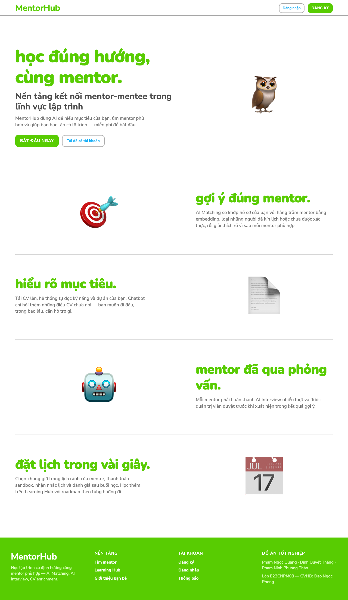
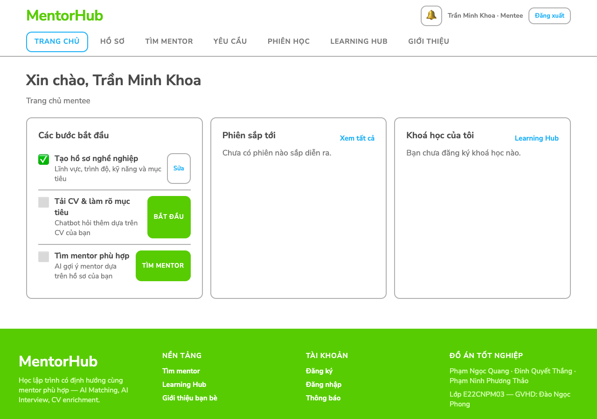
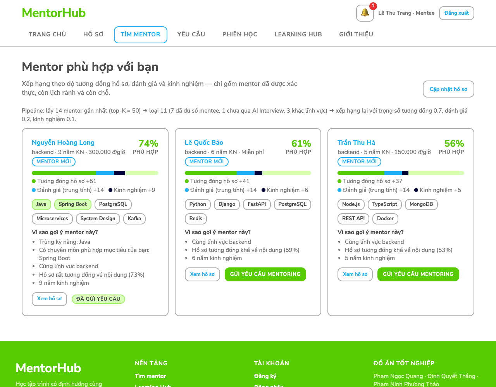
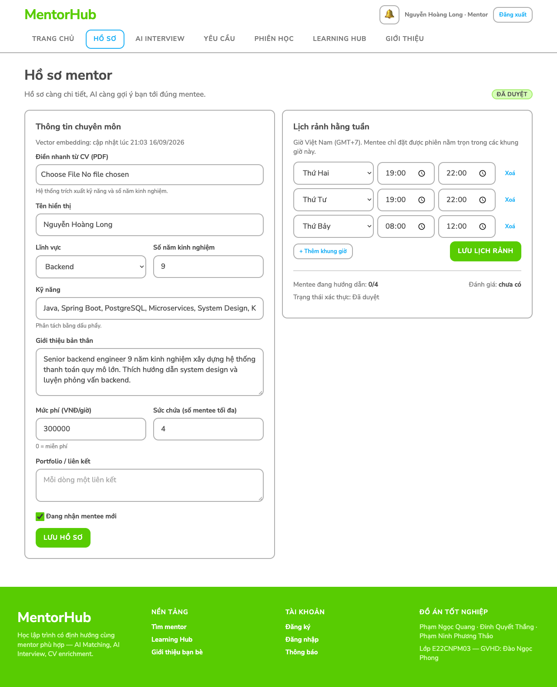
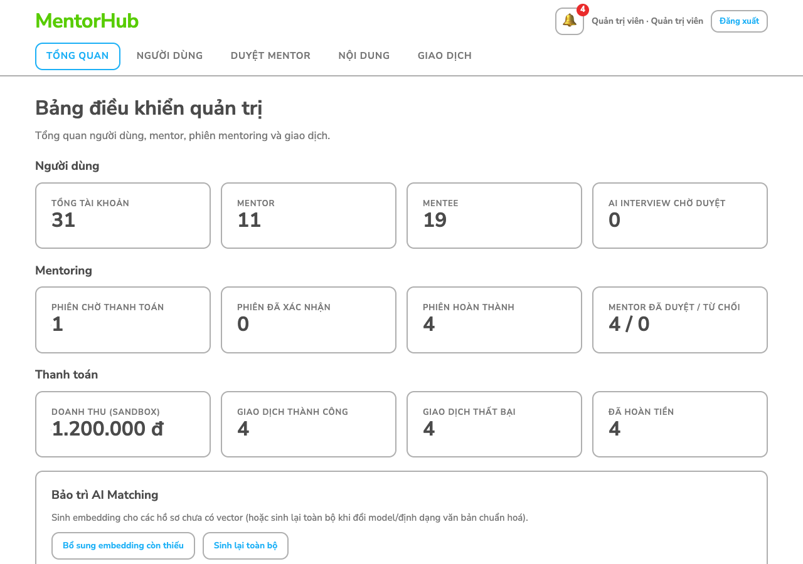
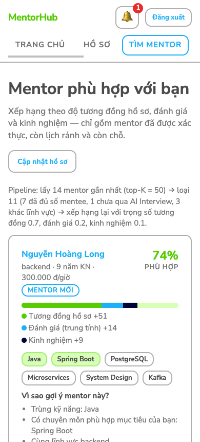
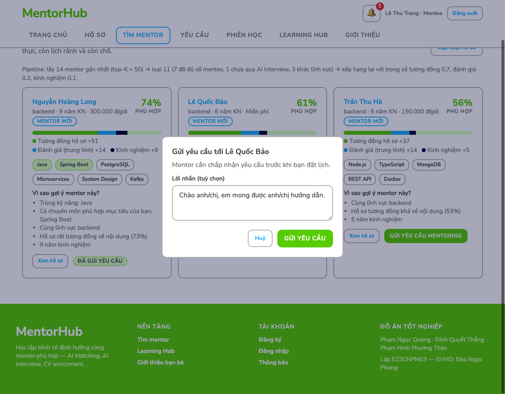
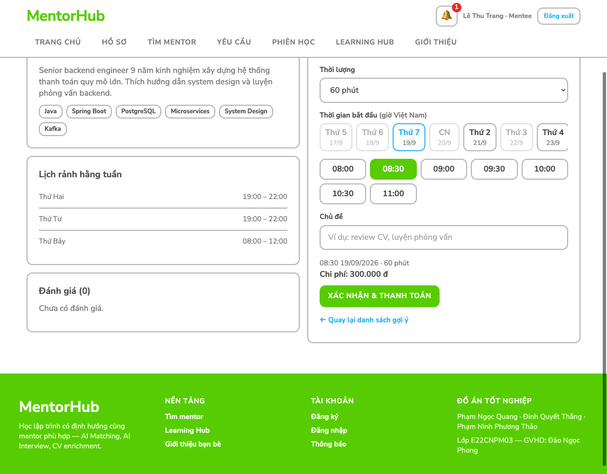

# Thiết kế giao diện — MentorHub

Giao diện frontend (Next.js 14) áp dụng design system do nhóm cung cấp trong 3 file:

| File | Vai trò |
|---|---|
| `frontend/DESIGN.md` | Mô tả phong cách, token màu/chữ/khoảng cách, thành phần, Do's & Don'ts |
| `frontend/tokens.json` | Design tokens dạng W3C (màu, typography, spacing, radius, surface) |
| `frontend/tailwind/theme.css` | Cùng bộ token ở dạng `@theme` của Tailwind CSS v4 |

## 1. Cách tích hợp

- Tailwind CSS v4 (`tailwindcss`, `@tailwindcss/postcss`, cấu hình `frontend/postcss.config.mjs`).
- `src/app/globals.css` nạp `@import "tailwindcss"` và `@import "../../tailwind/theme.css"`; toàn bộ lớp giao
  diện dùng chung (`.btn`, `.card`, `.badge`, `.nav`, `.footer`…) được viết lại **chỉ bằng biến token**
  (`var(--color-eager-green)`, `var(--text-nav-label)`, `var(--spacing-24)`, `var(--radius-xl)`…).
- Các biến ngữ nghĩa cũ của trang (`--primary`, `--good`, `--surface-2`…) được giữ làm alias trỏ về token.
- Font: `feather` và `duolingo-sans` là font độc quyền → dùng bản thay thế DESIGN.md gợi ý, nạp bằng
  `next/font/google` (tự host lúc build, có bộ ký tự tiếng Việt): **Nunito 900** cho tiêu đề display,
  **Nunito Sans 500/700** cho nội dung.

## 2. Áp dụng quy tắc

| Quy tắc trong DESIGN.md | Hiện thực |
|---|---|
| Nền trắng Paper White cho mọi section | `body`, `.card`, `.nav` nền `#ffffff` |
| Eager Green cho CTA, tiến độ, tiêu đề display, footer | `.btn` (nền xanh, chữ trắng 15px/700 viết hoa, tracking 0.795px), `.progress`, `.display`, `.footer` |
| Spark Blue cho link & nút phụ viền | `a`, `.btn.secondary` (viền 2px Faded Gray, chữ xanh dương 14px/700), menu đang chọn |
| Chữ nội dung Pencil Gray 17px/500; tiêu đề Charcoal | `body` 17px/500 `#777777`; `h1` 32px/700 `#4b4b4b` (Hero Headline) |
| Font display chỉ dùng từ 48px trở lên | `.display` 64px (48px trên mobile và `.display.md`) — chỉ ở trang chủ |
| Mọi nút/pill bo 12px, viền dày 2px | `.btn`, `.badge`, `.chip`, input, card, bubble chat đều `--radius-xl` + viền 2px |
| Nhãn menu viết hoa 15px, tracking 0.053em | `.nav-links a`, `.tabs button`, tiêu đề cột bảng, nhãn thống kê |
| Không gradient / shadow / glass | Đã bỏ toàn bộ `box-shadow` và gradient (vòng điểm AI Interview chuyển sang vòng viền phẳng) |
| Bố cục editorial: chữ trái – minh hoạ phải, section cách nhau rộng, không lưới thẻ | Trang chủ: 5 section xen kẽ trái/phải, cách nhau 80px, minh hoạ bằng hình lớn |
| Footer dải xanh full-bleed | `components/Footer.js` |
| Max width 1200px, card padding 16–24px, element gap 12px | `.container`, `.card`, `.row` |

## 3. Điểm điều chỉnh có chủ đích (ngoài DESIGN.md)

| Điều chỉnh | Lý do |
|---|---|
| Thêm 2 màu phản hồi `--color-feedback-error: #ea2b2b`, `--color-feedback-warning: #ffc800` | Bảng màu gốc không có màu lỗi/cảnh báo; ứng dụng cần báo lỗi (thẻ bị từ chối, huỷ phiên…) và hiển thị sao đánh giá. Chỉ dùng cho trạng thái phản hồi, không dùng cho giao diện chung |
| Link footer màu Paper White thay vì Fresh Leaf | Fresh Leaf trên nền Eager Green có độ tương phản quá thấp, khó đọc |
| Header 2 tầng (logo + tài khoản / menu) | Ứng dụng có 5–7 mục menu mỗi vai trò, không vừa 1 hàng với nhãn viết hoa 15px; trên điện thoại menu thành 1 hàng cuộn ngang |
| Trang ứng dụng (dashboard, danh sách) dùng lưới thẻ | Quy tắc "không lưới thẻ" dành cho trang giới thiệu; màn hình nghiệp vụ cần hiển thị nhiều dữ liệu song song |
| Hộp thoại có lớp phủ tối `rgb(0 4 55 / 0.35)` (Night Ink) | DESIGN.md không có thành phần modal; lớp phủ làm nổi hộp thoại mà vẫn không dùng shadow/gradient |

## 4. Thành phần tương tác

| Thành phần | File | Hành vi |
|---|---|---|
| Hộp thoại xác nhận / nhập liệu | `components/ui.js` — `useDialog()` | Thay toàn bộ `window.confirm` / `window.prompt` (gửi yêu cầu, từ chối yêu cầu, kết thúc mentoring, huỷ phiên, xoá nội dung, sinh lại embedding). `await ask({...})` trả chuỗi / `true` / `null`; tự focus, đóng bằng Esc hoặc bấm ra ngoài; nút thao tác phá huỷ dùng `.btn.danger` và nói rõ hậu quả (hoàn tiền, xoá dây chuyền) |
| Phân rã điểm phù hợp | `app/matching/page.js` — `ScoreBreakdown` | Thanh 3 màu = tương đồng hồ sơ (Eager Green) + đánh giá (Spark Blue) + kinh nghiệm (Night Ink) theo trọng số pipeline; phần đánh giá lấy phần còn lại của `finalScore` nên luôn khớp matching-service (kể cả rating trung tính của *Mentor mới*) |
| Bộ chọn khung giờ | `features/mentoring/SlotPicker.js` | Gọi `GET /api/mentoring/mentors/{id}/available-slots`; hàng ngày 14 ngày tới (ngày không còn giờ bị mờ, cuộn ngang trên điện thoại) + lưới giờ bắt đầu; đổi thời lượng thì tải lại và bỏ chọn giờ không còn hợp lệ; nút *Xác nhận* khoá tới khi đã chọn giờ |

## 5. Ảnh chụp giao diện

Chụp tự động bằng Chrome headless với dữ liệu demo (`scripts/seed_demo.py`), khung 1280px và 390px.

| Trang | Ảnh |
|---|---|
| Trang chủ |  |
| Dashboard mentee |  |
| Mentor phù hợp (AI Matching) |  |
| Hồ sơ mentor + lịch rảnh |  |
| Bảng điều khiển admin |  |
| AI Matching trên điện thoại |  |
| Hộp thoại gửi yêu cầu mentoring |  |
| Bộ chọn khung giờ đặt lịch |  |
