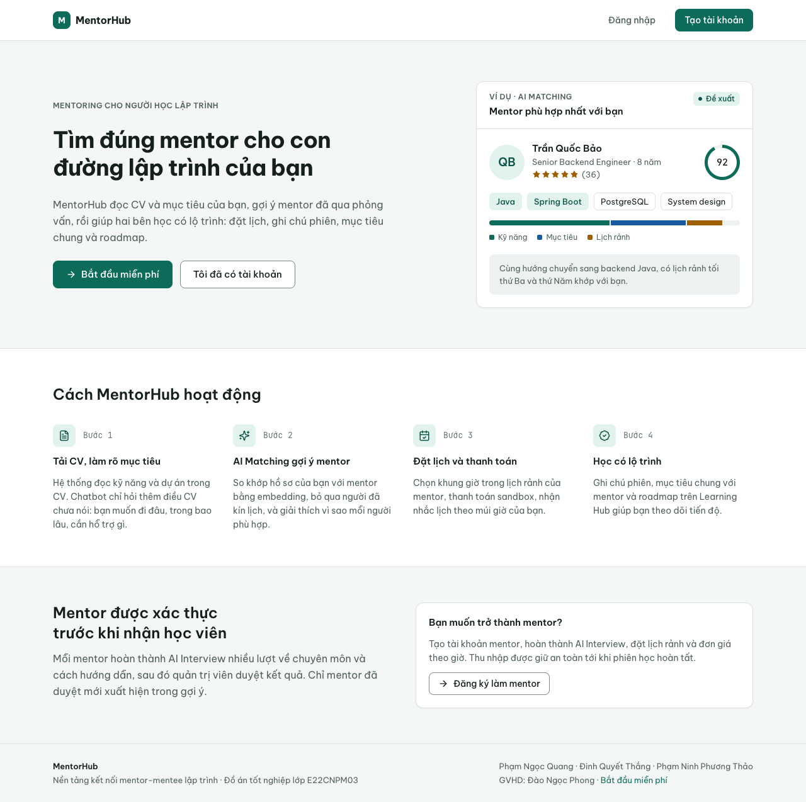
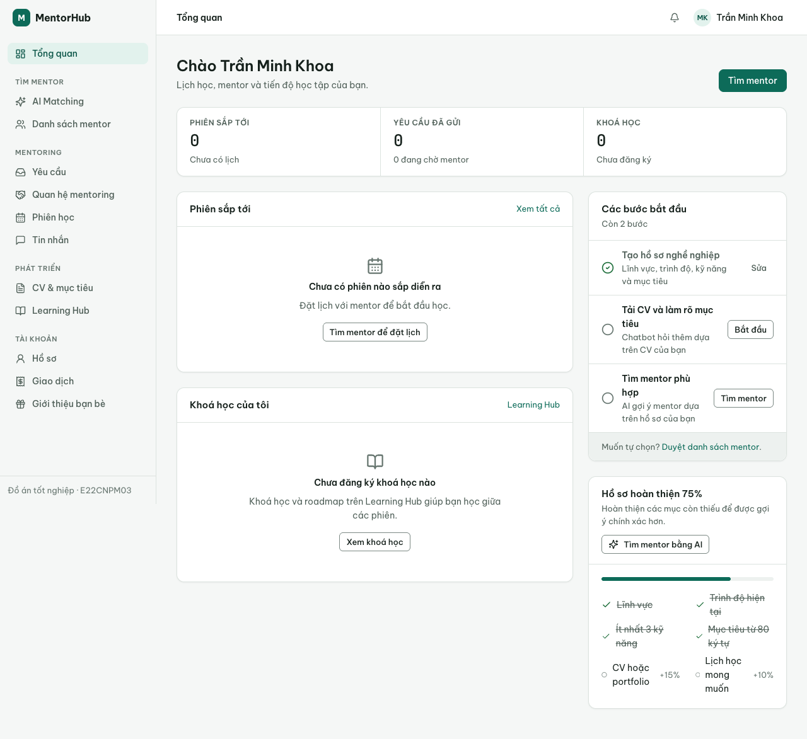
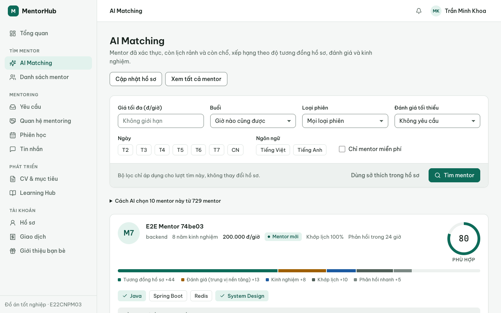
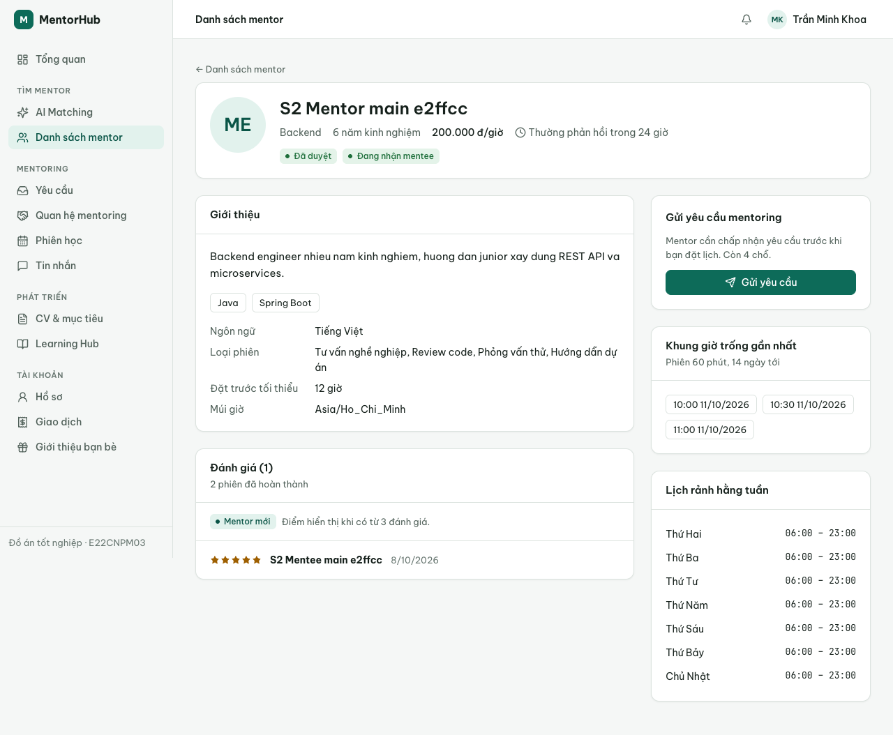
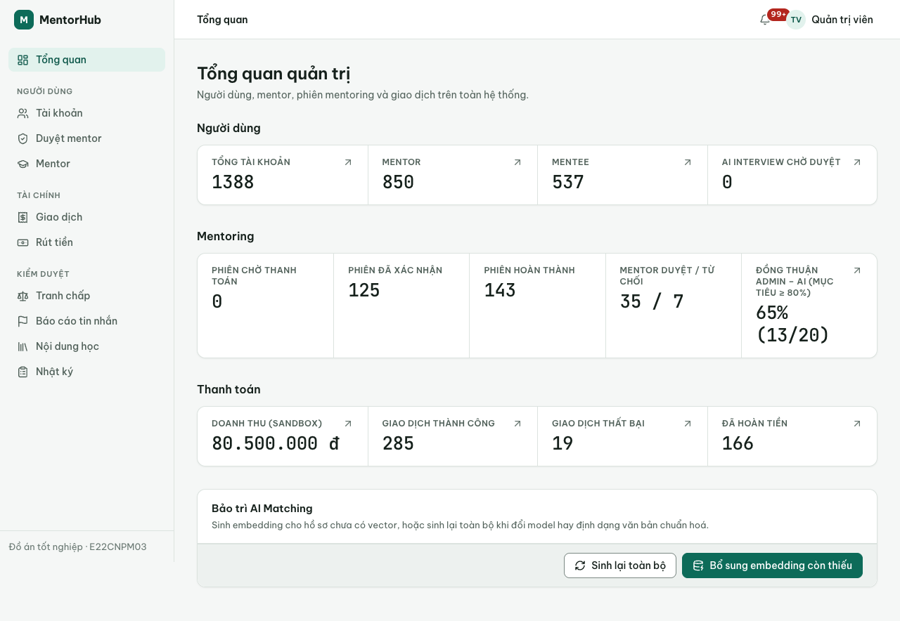
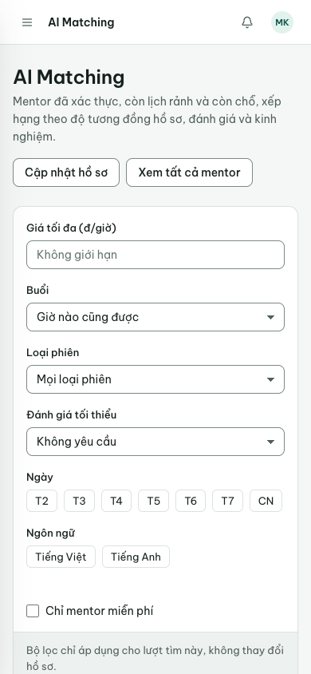
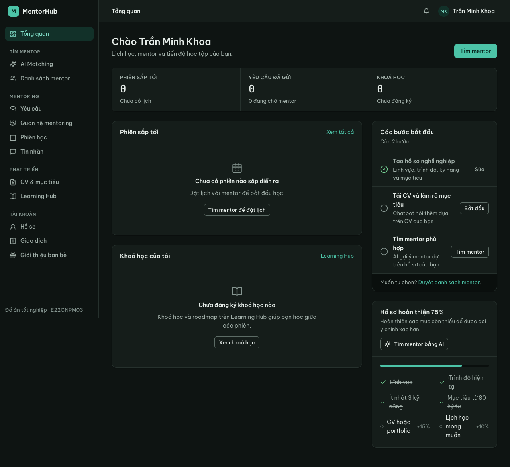
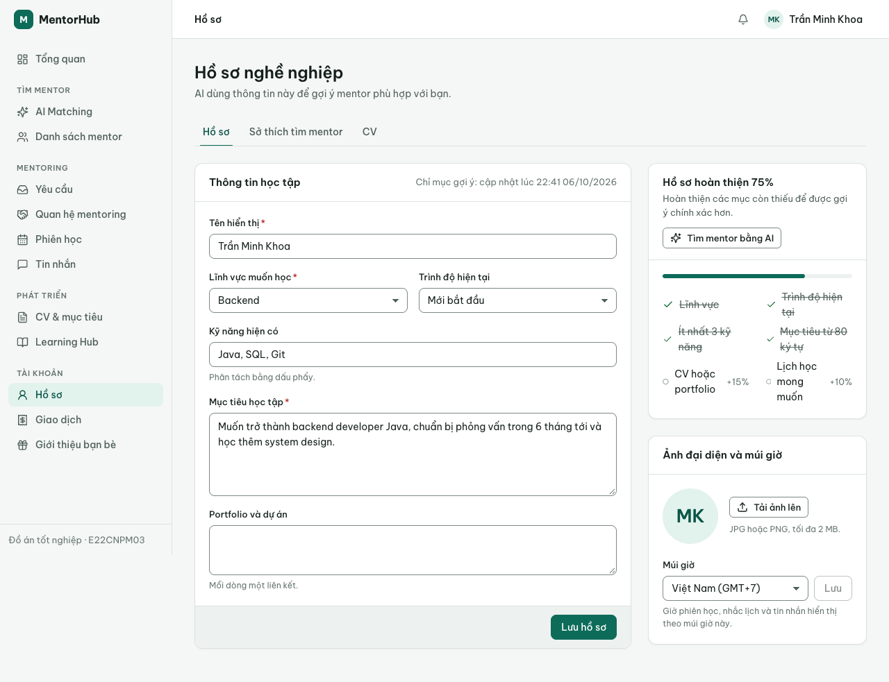

# Thiết kế giao diện

Giao diện MentorHub dùng design system **MentorHub** được xây trên Claude Design
(<https://claude.ai/artifact/WViqsnLfX7GWD1M6EbpXjp>): brand book, token màu/chữ/khoảng cách, 19 component kèm
preview trực tiếp. Mã nguồn của design system nằm trong repo và là nguồn duy nhất cho cả app lẫn Claude Design.

## 1. Cấu trúc

| File | Vai trò |
|---|---|
| `frontend/design-system/tokens.json` | Token gốc: 25 màu (theme sáng + tối), 2 họ font, 11 kiểu chữ, 8 bước khoảng cách, 4 bán kính bo góc, 3 mức bóng |
| `frontend/design-system/build-tokens.mjs` | Sinh `src/styles/tokens.css` (app) và `design-system/tokens.css` (Claude Design) từ `tokens.json` |
| `frontend/design-system/README.md` | Brand book: nguyên tắc, nội dung, màu, chữ, khoảng cách, bố cục, biểu tượng |
| `frontend/design-system/components/<Comp>/` | `README.md` (hướng dẫn dùng) + `preview.html` (preview trên Claude Design) cho từng component, và `Cover` |
| `frontend/src/styles/components.css` | CSS của component (`.btn`, `.card`, `.badge`…), CSS thuần nên dùng lại làm `components/bundle.css` trên Claude Design |
| `frontend/src/components/ui/index.tsx` | Component React: `Button`, `Card`, `Field`, `Badge`, `StatusBadge`, `Alert`, `Tabs`, `Table`, `ListRow`, `Stat`, `Avatar`, `EmptyState`, `ScoreRing`, `Progress`, `Stars`, `PageHeader`, `useDialog`, `Modal`, `Pagination`… |
| `frontend/src/components/shell/` | `AppShell` (sidebar theo vai trò + thanh trên), `PublicShell`, `AuthCard`, cấu hình menu `nav.ts`, theme sáng/tối |

`src/app/globals.css` nạp Tailwind CSS v4, `tokens.css` và `components.css` (trong `@layer components`), rồi map token sang
tiện ích Tailwind qua `@theme inline` (`bg-surface`, `text-ink-muted`, `text-title-2`…). Bảng màu mặc định của Tailwind bị
xoá (`--color-*: initial`) nên trang chỉ dùng được màu của design system. Tailwind chỉ dùng cho bố cục; màu, bo góc, bóng
và font đều trỏ về token.

Đổi token: sửa `design-system/tokens.json` → `node design-system/build-tokens.mjs` → đồng bộ lên Claude Design.

## 2. Định hướng

- **Warm & calm**: nền trắng ấm như giấy (`bg` `#faf9f7`), bề mặt và sidebar trắng (`surface`), chữ xám ấm
  (`ink` `#292524`) thay cho đen; một màu nhấn duy nhất **Teal** `#0f766e` (`accent`) cho hành động chính, mục đang chọn,
  link và vòng focus. Sprint 6 đổi từ bảng xám ngả xanh + Pine đậm sang bảng ấm, nhẹ mắt hơn (nhóm chọn từ 3 phương án
  có cùng mức tương phản AA). Theme tối dùng nền nâu than ấm và teal sáng `#3cc9b6`.
- Mỗi màn hình chỉ một nút `primary`; dữ liệu nhiều phần (phân rã điểm) dùng một màu với độ đậm nhạt khác nhau, không
  dùng nhiều màu. Các nguyên tắc UI/UX khác ở `CONVENTIONS.md` mục 1.
- Trạng thái luôn có chữ đi kèm màu (`StatusBadge`); success và danger khác nhau cả về độ sáng.
- Số liệu (tiền, mã giao dịch, điểm phù hợp) dùng **JetBrains Mono** với chữ số đều cột; chữ giao diện dùng
  **Be Vietnam Pro** (thiết kế cho dấu tiếng Việt). Cả hai tự host qua `@fontsource`.
- Theme sáng và tối đầy đủ: **mặc định sáng**; nút mặt trăng/mặt trời trên thanh trên (cả trang công khai) chuyển nhanh
  sáng ↔ tối, menu tài khoản có thêm "Theo hệ thống" (`data-theme` trên `<html>`, lưu trong `localStorage`).
- Mọi cặp chữ / nền đạt WCAG AA (≥ 4.5:1) ở cả hai theme; viền điều khiển (`border-strong`) và vòng focus ≥ 3:1.

## 3. Bố cục và điều hướng

| Khu vực | Bố cục |
|---|---|
| Trang công khai (giới thiệu, đăng nhập, đăng ký, khôi phục mật khẩu, xác thực email) | `PublicShell`: thanh trên + chân trang; biểu mẫu trong `AuthCard` 420px ở giữa |
| Sau khi đăng nhập | `AppShell`: sidebar 248px nhóm theo vai trò, thanh trên 56px (tiêu đề trang, chuông thông báo, menu tài khoản), nội dung tối đa 1160px. Dưới 960px sidebar thành ngăn kéo mở bằng nút menu |
| Banner xác thực email | Dải cảnh báo dưới thanh trên (US-39) |

Nhóm menu: **Mentee** Tổng quan · Tìm mentor · Mentoring (Yêu cầu, Quan hệ mentoring, Phiên học, Tin nhắn) · Phát triển
(Hồ sơ, CV & mục tiêu, Learning Hub). "Tìm mentor" là một mục, gồm hai tab `FindMentorTabs`: Gợi ý cho bạn (`/matching`)
và Tất cả mentor (`/mentors`). **Mentor** Tổng quan · Mentoring · Thu nhập (Thu nhập, Giao dịch) · Hồ sơ mentor (Hồ sơ,
AI Interview, Learning Hub). Mục ít dùng (Giao dịch của mentee, Giới thiệu bạn bè) nằm trong menu tài khoản
(`ACCOUNT_LINKS` trong `nav.ts`). **Admin** Tổng quan · Người dùng (Tài khoản, Duyệt mentor, Mentor) · Tài chính (Giao dịch, Rút tiền) ·
Kiểm duyệt (Tranh chấp, Báo cáo tin nhắn, Nội dung học, Nhật ký).

Trang được tổ chức lại theo nguyên tắc "tóm tắt trước, chi tiết sau": `PageHeader` → dải `Stats` (khi số liệu là trọng
tâm) → nội dung chính bên trái (~2/3) và ngữ cảnh bên phải. Các trang dài được tách thành tab: Hồ sơ (thông tin / lịch và
đặt lịch / trạng thái / CV; `/profile#availability` mở thẳng tab lịch), Yêu cầu (đang chờ / đang hoạt động / đã đóng),
Thu nhập (theo phiên / rút tiền), Nội dung học của admin (khoá học / roadmap). URL các trang giữ nguyên.

| Màn hình | Bố cục (Sprint 6) |
|---|---|
| Onboarding mentee (`/onboarding`) | Sau khi đăng ký, mentee đi qua 3 bước: lĩnh vực + trình độ → kỹ năng (gợi ý theo lĩnh vực, ≥ 3) → mục tiêu (ghép từ lựa chọn + chi tiết, ≥ 80 ký tự). Mỗi câu ghi rõ vì sao hỏi. Lưu bằng `PUT /api/profile/mentee/{id}`, đủ 75% hồ sơ để mở AI Matching, rồi chuyển thẳng tới gợi ý mentor. CV, lịch học, ngân sách hỏi sau |
| Tổng quan (`/dashboard`) | Khối "bước tiếp theo" chọn một việc quan trọng nhất (phiên sắp tới → yêu cầu chờ → bước chưa xong → xem gợi ý → đặt lịch) với nút chính duy nhất. Dải số liệu chỉ hiện khi đã có hoạt động; thẻ trống bị ẩn; checklist gộp mức hoàn thiện hồ sơ và tự ẩn khi xong |
| Tìm mentor (`/matching`) | 3 mentor phù hợp nhất dạng thẻ, mỗi thẻ có nhãn điểm mạnh (Phù hợp nhất / Lịch khớp nhất / Giá tốt nhất…), tối đa 3 lý do riêng (bỏ lý do mọi mentor đều có) và kỹ năng trùng. Còn lại là danh sách gọn. Phân rã điểm, đủ lý do và "Không phù hợp" nằm sau "Vì sao N% phù hợp?". Bộ lọc thu gọn sau nút "Bộ lọc" kèm tóm tắt bộ lọc đang bật |

## 4. Thành phần tương tác

| Thành phần | File | Hành vi |
|---|---|---|
| Hộp thoại xác nhận / nhập liệu | `components/ui` — `useDialog()` | Thay `window.confirm` / `window.prompt`. `await ask({...})` trả chuỗi / `true` / `null`; tự focus, đóng bằng Esc hoặc bấm ra ngoài; thao tác phá huỷ dùng nút `danger` và nói rõ hậu quả |
| Phân rã điểm phù hợp | `app/matching/page` — `ScoreBreakdown` | Thanh `.meter` 5 phần (tương đồng hồ sơ, đánh giá, kinh nghiệm, khớp lịch, phản hồi nhanh) theo `scoreParts` của matching-service, cộng lại đúng bằng `finalScore`; một màu `accent` nhạt dần theo thứ tự phần, mở bằng `
` |
| Bộ chọn khung giờ | `features/mentoring/SlotPicker` | Dải 14 ngày (ngày hết giờ bị khoá) + lưới giờ bắt đầu; đổi thời lượng thì tải lại và bỏ chọn giờ không còn hợp lệ; ghi rõ múi giờ hiển thị |
| Đặt lịch | `app/mentoring/book/[mentorId]` | Biểu mẫu bên trái, thẻ tóm tắt (thời gian, chi phí, nút xác nhận) dính bên phải |

## 5. Ảnh chụp giao diện

Chụp tự động bằng Chrome headless với dữ liệu demo (`scripts/seed_demo.py`), khung 1280px và 390px.

| Trang | Ảnh |
|---|---|
| Trang chủ |  |
| Tổng quan mentee |  |
| AI Matching |  |
| Hồ sơ mentor |  |
| Tổng quan quản trị |  |
| AI Matching trên điện thoại |  |
| Tổng quan, theme tối |  |
| Hồ sơ nghề nghiệp (tab) |  |
